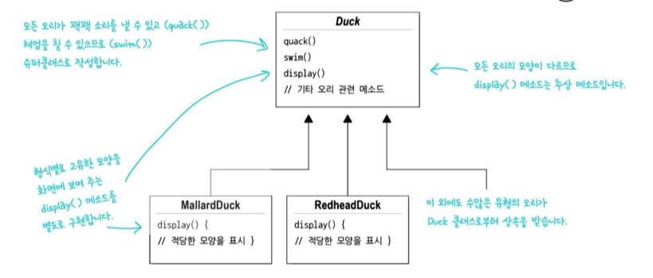

# 💈디자인 패턴 소개(#전략 패턴)  
***
#
### ☑️다른 개발자가 우리와 똑같은 문제를 경험하고 해결하면서 익혔던 지혜와 교훈을 살펴보고,  그것을 어떻게 활용할 수 있는지 배우자
# 
## * 디자인 패턴은 코드가 아닌 경험을 재사용하는 것!
#

-----------------------------
### <오리 시뮬레이션 게임>
#

표준 객체지향 기법을 사용하여 **Duck**이라는 슈퍼클래스 생성, 확장해서 다른종류의 오리를 만들었다

--------------------------------------
#
## <문제 발생>

- Duck이라는 슈퍼클래스에 `fly()` 메소드를 추가하면서 
일부 서브클래스에 적합하지 않은 행동이 추가
- 상황에 따라 오버라이드를 다 해줘야 한다 -> 힘들다
- 인터페이스로 설계하면 어떨까?
#
__[Duck의 행동을 상속할때 단점이 되는 요소]__

- 서브클래스에서 코드가 중복된다
  - (같은 일을 하는)코드의 중복은 자원낭비를 일으킴
- 실행 시에 특징을 바꾸기 힘들다
  - 런타임시에 유동적으로 휙휙 바꾸기 힘들다
- 모든 오리의 행동을 알기 힘들다
  - 일일이 다 확인해야 한다 모두 Duck을 상속받을 테니 각 클래스마다 특징이 없다
- 코드를 변경했을 때 다른 오리들에게 원치 않은 영향을 끼칠 수 있다
  - 하나의 슈퍼클래스를 모든 오리가 상속받으니

---------------

## <문제 파악>
## 디자인 원칙🍀 - 디자인패턴의 기반
- 달라지는 부분을 찾아서 나머지 코드에 영향을 주지않도록 캡.슐.화 한다
- 즉, 바뀌는 부분과 그렇지 않은 부분을 분리하자
#

#
`fly()`와 `quack()`을 Duck 클래스로부터 분리하려면 2개의 메소드를 모두  Duck 클래스에서 끄집어 내서 각 행동을
나타낼 클래스 집합을 새로 만들어야 한다
#

---------------------------
### 이렇게 해서 우리는 클래스집합을 구분했는데 어떻게 디자인 할까??

## 디자인 원칙🍀🍀

- 구현보다는 인터페이스에 맞춰서 프로그래밍 한다.
- 즉, 실행 시에 쓰이는 객체가 코드에 고정되지 않도록 상위 형식에 맞춰 프로그래밍해서 다형성을 활용해야 한다
#

- 이런 식으로 디자인하면 다른 형식의 객체에서도 나는 행동과 꽥꽥거리는 행동을 **재사용** 할 수 있다.
- Duck클래스를 전혀 **건드리지 않고도** 새로운 행동 추가 가능
- 가장 중요한 점은 **나는 행동**과, **꽥꽥거리는 행동**을 Duck 클래스에서 정의한 메소드를 써서 구현하지 않고,  다른 클래스에
**위임**한다는 것이다
#

------------------
## 디자인 원칙🍀🍀🍀
- 상속보다는 구성을 활용한다
- 즉, 각각 **나는행동**과 **꽥꽥거리는 행동**을 위임 받는데,  이런식으로 두 클래스를 합치는 것을 **구성**을 이용한다 라고 부른다
#

-------------------
#
### ❗️앞서 배운 알고리즘군을 정의하고 캡슐화하는 패턴을 전략패턴이라고 한다.❗️
#
## 🏴#전략패턴
- **알고리즘군**(각 행동 집합 ex: FlyNoWay클래스)을 정의하고 **캡슐화**해서   각각의 알고리즘군을 수정해서 쓸 수 있게 해준다
- 전략패턴을 사용하면 클라이언트로부터 알고리즘을 분리해서 독립적으로 변경할 수 있다
#

------------------------
## 🔎 Q & A

Q.패턴을 찾을 수 없다면?
#
A.패턴의 밑바닥에는 객체지향 패턴이 존재한다.

객체지향의 기초와 원칙을 
안다면 패턴을 찾을 수 없을 때 도움이된다 

관리가 용이한 객체지향 시스템을 만드는 비결중 하나가 **나중에 어떻게 바뀔 것인지** 생각하는 것 이다!

-----------------------
## 💥마치며..
__⭕️추상화나 상속, 다형성과 같은 개념만을 안다고 해서 훌륭한 객체지향 디자이너가 되는것이 아니다__

__⭕상황에 맞게 변경할 수 있는 **유연한** 디자인을 만드는게 중요!!!__
#
### <📦객체지향의 기초>
- 추상화
- 캡슐화
- 다형성
- 상속

### <📦객체지향의 원칙(🍀디자인원칙🍀)>
- 바뀌는 부분은 캡슐화한다. -> **관리의 용이성**
- 상속보다는 구성을 활용한다 -> **재사용성**
- 구현보다는 인터페이스에 맞춰서 프로그래밍 한다. -> **확장성**
  
- +) 더 추가될 예정

## 🔑(#전략패턴도 마찬가지로)모든 패턴들이 객체지향의 기본개념과 원칙에 의존한다
