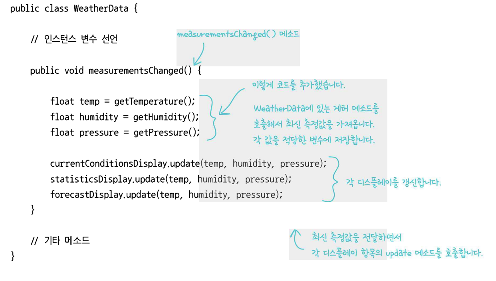

# 💈디자인 패턴 (#옵저버 패턴)
***
#
### ☑️옵저버 패턴에 대해 알아보자
# 
## 📌 신문사 + 구독자 = 옵저버 패턴
## 📌 한 객체의 상태가 변경되면 그 객체에 의존하는 <br>모든 객체에게 연락이 간다
#
#
#
## <정의>
#


#
- 옵저버 패턴은 신문사와 구독자로 이루어지는 신문 구독 서비스와 유사하다
- 옵저버 패턴은 일련의 객체 사이에 1: N 관계
- 보통 주제(subject)인터페이스와 옵저버(observer) 인터페이스를 통해 구현

#


--------------------------------------
#
#
## <문제 발생>
#
-주제(subject) 클래스의 예제
#


#
- 인터페이스가 아닌 구체적인 구현을 바탕으로 코딩을 하고 있다
  - `currentConditionsDisplay.update()`메소드를 살펴보면 <br>구체적인 구현을 바탕으로 코딩을 하고 있다는 점을 알 수 있다
- 새로운 디스플레이 항목이 추가될 때마다 코드를 변경해야 한다
  - 새로운 디스플레이 항목이 추가되면 밑에다 또 적어야하는 번거로움이 존재
- 실행 중에 디스플레이 항목을 추가하거나 제거할 수 없다
  - 런타임 시에 접근할 수 없다

*위에 세가지 문제점 모두 유연하지 못한 코딩으로 객체지향의 기본인 <br> **나중에는 어떻게 변할 것인가?** 를 고려하지 않은 상태를 의미한다
  -> **추상화**랑 **다형성**을 고려해야겠네..!
- 바뀌는 부분을 캡슐화하지 않았다
  - 여기서 **캡.슐.화**란?
    - 관.련이 있는 변수와 함수를 하나의 클래스로 묶고 <br>외부에서 쉽게 접근하지 못하게 하는 것!
  - 정보은닉과 바뀌는 부분과 바뀌지 않는 부분을 나누어 더 효과적인 설계가 된다
#

__[✏️여기서 잠깐!]__

우리는 **#전략패턴** 을 공부하면서 **객체지향의 기초** 와 **객체지향의 원칙** 을 공부했었다
#
### <📦객체지향의 기초>
- 추상화
- 캡슐화
- 다형성
- 상속


#


### <📦객체지향의 원칙(🍀디자인원칙🍀)>
- 바뀌는 부분은 캡슐화한다. -> **관리의 용이성**
- 상속보다는 구성을 활용한다 -> **재사용성**
- 구현보다는 인터페이스에 맞춰서 프로그래밍 한다. -> **확장성**
- +) 더 추가될 예정

### ⭕️#옵저버패턴 또한 객체지향의 원칙과 기초에 기반하고 있구나!
#
#
## <원칙으로 추가 코드 살펴보기>
#


#
- 위에 코드를 살펴보면 캡슐화, 다형성, 추상화를 이용해야겠다고 생각든다.
#
#

---------------
#
## <패턴의 구조>
#
### 🛠Class Diagram


#


#
- Duck객체 또한 옵저버가 될 수 있다
#

---------------------------

#
## 디자인 원칙🍀🍀🍀🍀
- 상호작용하는 객체 사이에는 가능하면 느슨한 결합을 사용해야 한다
  - 즉, 코드의 재사용을 높이고 유연성을 취한다

#
## <느슨한 결합의 위력>
#
- **느슨한 결합** 은 객체들이 상호작용할 수는 있지만, 서로를 잘 모르는 관계를 의미
  - 즉, 유연성이 올라간다
    - #옵저버 패턴은 느슨한 결합을 보여주는 훌륭한 예
#
### 강한결합 vs 느슨한 결합
#
#### -강한결합 예제
#
``` java
public class Remote
{
private Television Tv { get; set; }

    protected Remote()
    {
        Tv = new Television();
    }

    static Remote()
    {
        _remoteController = new Remote();
    }
    static Remote _remoteController;

    public static Remote Control
    {
        get
        {
            return _remoteController;
        }
    }
    public void RunTv()
    {
        Tv.Start();
    }
}
```
#
- TV는 리모콘이 없으면 동작을 못한다
  - TV는 remote클래스 안에서 생성이 되고 노출이 안됨
- TV의 변경이 직접적으로 리모컨에 영향을 준다
- 이 리모컨은 TV만 제어가 가능하고 다른 장비들은 제어 못한다
#
#
#### -느슨한 결합 예제

``` java
public interface IRemote
{
    void Run();
}

public class Television : IRemote
{
    protected Television()
    {
    }

    static Television()
    {
        _television = new Television();
    }

    private static Television _television;

    public static Television Instance
    {
        get
        {
            return _television;
        }
    }

    public void Run()
    {
        Console.WriteLine("Television is started!");
    }
}

public class Remote
{
    IRemote _remote;

    public Remote(IRemote remote)
    {
        _remote = remote;
    }

    public void Run()
    {
        _remote.Run();
    }
}

class Program
{
    static void Main(string[] args)
    {
        Remote remote = new Remote(Television.Instance);
        remote.Run();
        Console.Read();
    }
}
```
#
- 시험 가능성(testablility)을 향상시킨다
- 인터페이스에 대한 프로그램의 GOF원칙(구현하지 않기)를 준수하는데 도움이 된다
- 의존성이 적어 코드나 객체, 구성의 변경이 용이하다
- `IRemote`인터페이스만 준수하면 TV뿐만 아니라 다른장비도 연동 가능 -> 확장성
#
#
### 🛠Class Diagram
#


- 주제는 옵저버가 특정 인터페이스(Observer 인터페이스)를 구현한다는 사실만 안다.
  - 옵저버 인터페이스를 구현한 클래스가 무슨 일을 하는지 알 필요가 없다
- 옵저버는 언제든지 새로 추가 할 수 있다
- 주제와 옵저버는 서로 독립적으로 재사용 할 수 있다
  - 주제난 옵저버를 **다른 용도**로 활용할 일이 있다고 해도 손쉽게 재사용 가능.
  - 둘이 단단하게 결합되어 있지 않기 때문에
- 주제나 옵저버가 달라져도 서로에게 영향을 미치지 않는다
  - 주제나 옵저버 인터페이스를 구현한다는 조건만 만족하면 된다

#
-> 지금의 방식은 **push방식**으로 주제가 옵저버에게 데이터를 보내주는것이지만
  이벤트가 발생할 때 마다 옵저버가 **pull방식**으로 데이터를 가져오는 것도 가능하다
(약간의 코드 수정 필요)

#
### pull 방식


#


-------------------
#
### ❗느슨한 결합을 가진 구조인 옵저버 패턴에 대해 알아 보았다❗️
#
#
## 🏴#옵저버 패턴
- 1 : N 관계이며, 한 객체의 **상태**가 바뀌면 그 객체에 (느슨하게) 의존하는 다른 객체에게 <br> 연락이 가고 
자동으로 내용이 갱신되는 방식이다
- 옵저버 패턴은 MVC패턴에서 다시 배워보자
#
#

------------------------
#
## 🔎 Q & A


Q.`update()`에서 `display()`를 호출하는 방법이 정말 최선인가??
#
A. **최선의 방법은 아니다**<br>데이터를 화면에 표시하는 더 좋은 방법은 **MVC패턴**이다
#

-----------------------
#
## 💥마치며..
__⭕️ 여러가지 객체지향의 기초를 접했는데 확장성, 재사용성 +(유연성), 캡슐화 등이 존재하였다__
#
- 확장성: 퍼져나가는것(추상화랑 다형성이랑 유사)
- 재사용성: 다른 것을 만들때도 코드가 또 쓰일 수 있는것
  - -> 느슨한 결합일 때 **good!**
- 캡슐화: 특정한 기준을 가지고 서로 분리해서 생각하는것
#
__⭕상황에 맞게 변경할 수 있는 **유연한** 디자인을 만드는게 중요!!!__
#
#
### <📦객체지향의 기초>
- 추상화
- 캡슐화
- 다형성
- 상속


#


### <📦객체지향의 원칙(🍀디자인원칙🍀)>
- 바뀌는 부분은 캡슐화한다. -> **관리의 용이성**
  - 달라지는 부분과 달라지지 않는 부분을 분리
- 상속보다는 구성을 활용한다 -> **재사용성**
  - ex)`Interface I;` 변수사용 (상속을 사용하는 것이 아닌)
- 구현보다는 인터페이스에 맞춰서 프로그래밍 한다. -> **확장성**
  - GOF원칙, 인터페이스를 이용하자!
- 상호작용하는 객체 사이에서는 가능하면 느슨한 결합을 사용해야한다 -> **재사용성, 유연성**
  - 인터페이스를 구현하는 객체를 만들면 느슨한 결합을 만들기 수월
- +) 더 추가될 예정

#
#
## 🔑 -> (#옵저버 패턴도 마찬가지로)모든 패턴들이 <br>객체지향의 기본개념과 원칙에 의존한다

