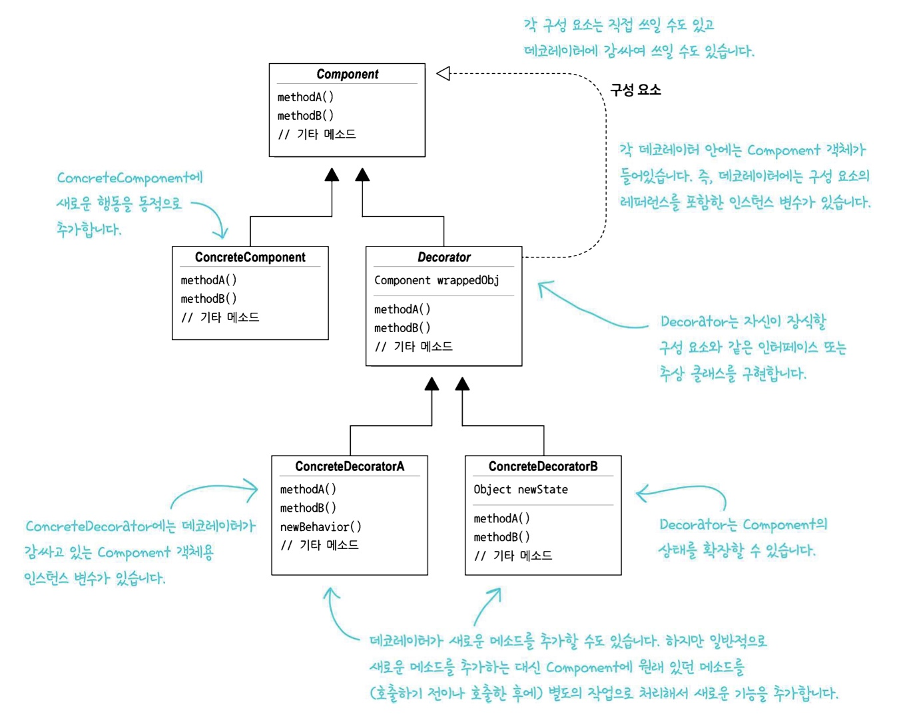

# 💈디자인 패턴 (#데코레이터 패턴)
***
  

### ☑️데코레이터 패턴에 대해 알아보자  
<br/>

## 📌 객체(커피) + 데코레이터(시럽) +데코레이터(휘핑) +.... <br>= 데코레이터 패턴  
  
<br/>

## <정의>  


<br/>


- 한 **객체**를 여러 개의 데코레이터로 감쌀 수 있습니다
- 데코레이터의 슈퍼클래스는 자신이 장식하고 있는 **객체**의 슈퍼클래스와 같습니다

--------------------------------------

## <문제 발생>   

-1) `Beverage클래스`를 다른 모든클래스들이 상속받는다 -> 상속의 문제점


  

-2) `슈퍼클래스(Beverage)`에 인스턴스 변수와 메소드를 추가해서 생각<br>클래스의 개수가 줄었지만 이 점도 문제가 많다


-2-1) 📃Code
``` java
  public class Beverage{
      //milkCost, soyCost, mochaCost, whipCost
      //각각에 해당하는 인스턴스 변수를 선언하고,
      boolean milk;
      boolean moka;
      ...
      //우유, 두유, 모카, 휘핑크림에 대한 게터와
      //세터 메서드를 선언한다
      
      public double cost(){
          double condimentCost = 0.0;
          
          if(hasMilk()){
              condimentCost += milkCost;
          }
          if(hasSoy()){
              condimentCost += soyCost;
          }
          if(hasMocha()){
              condimentCost += mochaCost;
          }
          if(hasWhip()){
              condimentCost += whipCost;
          }
          return condimentCost;
      }
      
      
  public class DarkRoast extends Beverage{
  
      public DarkRoast(){
          description = "최고의 다크 로스트 커피";
      }
      
      @Override
      public double cost(){
          return 1.99 + super.shot;
      }
  }  
```

- 첨가물 가격의 바뀔 때마다 기존 코드를 수정해야 한다.
    - 첨가물의 가격이 바뀌면 `Beverage클래스`를 수정해야 한다  


- 첨가물의 종류가 많아지면 새로운 메소드를 추가해야하고,<br>슈퍼클래스의 `cost()`메소드 또한 고쳐야한다
    - 새로운 첨가물의 `get(),set()`메소드를 추가해야하고,<br>`cost()`메소드에서 새로운 첨가물의 정보를 얻어오는 것을 추가해야한다  


- 특정 첨가물이 들어가면 안되는 음료가 생길 수 있다
    - 아이스티의 경우, `Tea서브 클래스`에서도 <br>`hasWhip()`과 같은 메소드가 여전히 상속받는다
  

*위에 세가지 문제점 모두 무분별한 상속을 통해 발생한 문제들이다

#

__[✏️여기서 잠깐!]__

우리는 **#옵저버 패턴** 을 공부하면서 **객체지향의 기초** 와 **객체지향의 원칙** 을 공부했었다

<br>

### <📦객체지향의 기초>
- 추상화
- 캡슐화
- 다형성
- 상속


<br/>


### <📦객체지향의 원칙(🍀디자인원칙🍀)>
- 바뀌는 부분은 캡슐화한다. -> **관리의 용이성**
  - 달라지는 부분과 달라지지 않는 부분을 분리
- 상속보다는 구성을 활용한다 -> **재사용성**
  - ex)`Interface I;` 변수사용 (상속을 사용하는 것이 아닌)
- 구현보다는 인터페이스에 맞춰서 프로그래밍 한다. -> **확장성**
  - GOF원칙, 인터페이스를 이용하자!
- 상호작용하는 객체 사이에서는 가능하면 느슨한 결합을 사용해야한다 -> **재사용성, 유연성**
  - 인터페이스를 구현하는 객체를 만들면 느슨한 결합을 만들기 수월<br>(확장성이 높고 의존성이 낮다)
- +) 더 추가될 예정


---------------
<br/>

## <상속 살펴보기>
<br/>

- 상속이 강력하긴 하나, 무조건 유연하거나 관리하기 쉬운 디자인 ❌ 
  - 서브클래스를 만드는 방식으로 행동을 상속받으면 그 행동은 컴파일할 때 완전히 결정된다<br> `VIPCustomer vip = new VIPCustomer();`
  - 게다가, 모든 서브클래스에서 똑같은 행동을 상속받아야 한다<br> -> 필요하지 않은 것까지 상속 받는다  


- 따라서, **구성**과 **위임**으로 실행중에 행동을 **상속**하는 방법을 쓰자
  - 실행중에 동적으로 행동 설정 가능(**구성**: `Customer vip;`) <br> `Customer vip = new VIPCustomer();` 
  - **위임** : 할 일을 다른 객체에게 위임한다
  - 기존의 코드를 고치는 대신 새로운 코드를 만들어서 기능 추가 가능


---------------

## <패턴의 구조>


<br/>

정리하자면,
  - 데코레이터의 슈퍼클래스는 자신이 장식하고 있는 객체의 슈퍼클래스이다
  - 한 객체를 여러개의 데코레이터로 감쌀 수 있다
  - **데코레이터는 자신이 감싸고 있는 객체와 같은 슈퍼클래스**를 가지고 있기에<br>원래 객체가 들어갈 자리에 데코레이터 객체를 넣어도 상관없다
  - 데코레이터는 자신이 장식하고 있는 객체에게 어떤 행동을 위임하는 일 말고도<br>**추가작업**을 수행할 수 있다


---------------------------


## 디자인 원칙🍀🍀🍀🍀🍀
- 클래스는 확장에는 열려있어야 하지만, 변경에는 닫혀 있어야 한다
    - 즉, **OCP** -> 코드의 변경(=오버헤드)은 하지 않으면서 시스템을 확장한다 <br>ex) 옵저버 패턴
    - 모든 부분에서 **OCP**를 준수하기는 어렵다
      - 가장 바뀔 가능성이 높은 부분을 중점적으로 살펴보고 **OCP**를 적용하자.


---------------------------

### 🛠Class Diagram




- `CondimentDecorator클래스`에서 `Beverage클래스`를 확장하고 있다
    - 상속이지만, **행동**을 상속받는게 아닌 **형식**을 상속받는다<br> 즉, 데코레이터를 만들 때 새로운 행동을 추가한다 (슈퍼클래스로부터 행동을 상속받는게 아닌)
      - **형식**: 데코레이터 객체가 일반 객체와 같은 인터페이스를 가져야 하는 이유
      - **행동**: 기본구성요소(`Espresso클래스`)와는 다른 데코레이터 등을 <br>인스턴스 변수에 저장하는 식으로 **연결**
- 객체구성(인스턴스 변수로 다른 객체를 저장하는 방식)을 이요하고 있다<br>`Customer vip = new VIPCustomer();`
    - 유연성을 잃지 않는다
    - 컴파일시 정적으로 결정되지 않는다
      - -> 실행중에 마음대로 조합해서 사용 가능
- 인터페이스나 추상클래스로 구성  


**<밑에 나오는 코드를 참고하여 이해하자>**

### 📃Code
Beverage class
``` java
public abstract class Beverage {
    String description = "제목 없음";

    public String getDescription(){
        return description;
    }
    public abstract double cost();
}
```  

CondimentDecorator class
``` java
public abstract class CondimentDecorator extends Beverage{
    Beverage beverage;
    public abstract String getDescription();
}
```  
Espresso class
``` java
public class Espresso extends Beverage{
  public Espresso(){
    description = "에소프레소";  //Beverage에서 인스턴스변수를 상속받는다
   }
  @Override
  public double cost() {
    return 1.99;
  }
}
```   

Mocha class
``` java
public class Mocha extends CondimentDecorator{

    public Mocha(Beverage beverage){
        this.beverage = beverage;
    }
    @Override
    public double cost() {
        return beverage.cost() + .20;
    }

    @Override
    public String getDescription() {
        return beverage.getDescription() + ", 모카";
    }
}
``` 


------------------------

## 🔎 Q & A

Q.위 코드를 그대로 쓰면 **구상 구성 요소**로 특별할인 같은 작업을 처리할 때 문제가 발생하지 않는가??<br> `HouseBlend`를 데코레이터로 감싸고 나면 그 커피가 하우스 블렌드인지 에스프레소인지 알 수 없지 않나?

<br/>

A. **구상 구성 요소**로 어떤 작업을 처리하는 코드에는 맞지 않다<br> 반대로, **추상 구성 요소**로 돌아가는 코드에는 데코레이터 패턴을 적용해야만 제대로 된 결과를 얻을 수 있다  

    Abstract Class Object (추상 구성요소)
    Abstract Class Decorator extends Object (추상 데코레이터)
    Class RealObject extends Object (구상 구성요소)
    Class RealDecorator extends Decorator (구상 데코레이터)

<br/>

Q. 휘핑을 마지막에 추가해야하는데 두유를 마지막에 추가하는 문제가 생길 수 있지 않냐

A. 그럴 수 있다 <br>하지만, 팩토리나 빌더같은 다른패턴으로 데코레이터를 만들고 사용하므로 문제X


-------------------

## 🏴#데코레이터 패턴
- 데코레이터는 감싸고 있는 객체에 행동을 추가하는 용도로 만들어 진다
  - 만약 여러 단계의 데코레이터를 파고 들어가서 어떤 작업을 해야한다면<br>원래 데코레이터 패턴이 만들어진 의도에 어긋난다
- OCP에 충실하면서(기존코드 수정X) 유연한 디자인을 만들 수 있다.
- 구성과 위임으로 실행중에 새로운 행동을 추가할 수 있다
- 행동을 확장한다
- 구성 요소의 클라이언트(`Espresso class`를 이용하는 클라이언트)는 데코레이터의 존재를 알 수 없다
  - 클라이언트가 구성 요소의 구체적인 형식에 의존하는 경우는 예외

<br/>


- __🔴문제점__
  1) 자잘한 클래스가 많이 생긴다
  2) 특정 형식에 의존하는 클라이언트 코드에 <br>데코레이터를 그냥 적용해버리면 문제가 생긴다
  3) 구성요소를 초기화 하는데 필요한 코드가 복잡해진다 <br> -> 이는, 팩토리와 빌더 패턴의 도움을 받아 해결
<br/>

-----------------------

## 💥마치며..  


- 확장성: 퍼져나가는것(추상화랑 다형성이랑 유사)
- 재사용성: 다른 것을 만들때도 코드가 또 쓰일 수 있는것
    - -> 느슨한 결합일 때 **good!**
- 캡슐화: 특정한 기준을 가지고 서로 분리해서 생각하는것  


__⭕상황에 맞게 변경할 수 있는 **유연한** 디자인을 만드는게 중요!!!__
<br/>
### <📦객체지향의 기초>
- 추상화
- 캡슐화
- 다형성
- 상속


#


### <📦객체지향의 원칙(🍀디자인원칙🍀)>
- 바뀌는 부분은 캡슐화한다. -> **관리의 용이성**
    - 달라지는 부분과 달라지지 않는 부분을 분리
- 상속보다는 구성을 활용한다 -> **재사용성**
    - ex)`Interface I;` 변수사용 (상속을 사용하는 것이 아닌)
- 구현보다는 인터페이스에 맞춰서 프로그래밍 한다. -> **확장성**
    - GOF원칙, 인터페이스를 이용하자!
- 상호작용하는 객체 사이에서는 가능하면 느슨한 결합을 사용해야한다 -> **재사용성, 유연성**
    - 인터페이스를 구현하는 객체를 만들면 느슨한 결합을 만들기 수월<br>(확장성이 높고 의존성이 낮다)
- 클래스는 확장에는 열려 있어야 하지만 변경에는 닫혀 있어야 한다
  - OCP : 기존코드 수정없이 행동을 확장한다 (행동을 상속받는 것이 아닌)
- +) 더 추가될 예정

#
#
## 🔑 -> (#데코레이터 패턴도 마찬가지로)모든 패턴들이 <br>객체지향의 기본개념과 원칙에 의존한다

