# 💈디자인 패턴 (#팩토리 패턴)

  

### ☑️팩토리(메서드,추상) 패턴에 대해 알아보자  
<br/>

## 📌 어떤 클래스의 인스턴스를 만들지 **서브클래스**가 결정한다. - 메서드(상속)
## 📌 구상클래스에 의존하지 않고 서로 연관되거나 의존적인 객체 생성 인터페이스 제공 - 추상(객체 구성)
  
<br/>

## <정의>  


- **사용하는 서브 클래스에 따라 생산되는 객체 인스턴스가 결정된다**

<br/>

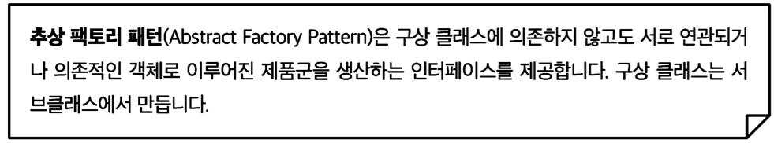

<br/>

--------------
<br/>

## <new연산자 살펴보기>
<br/>


- 구상클래스의 인스턴스가 여러개 있으며, 이런 코드를 변경하거나 확장해야 할 때는 <br> 코드를 다시 확인하고 **새로운 코드를 추가**하거나 **기존 코드를 제거**해야 한다
<br>-> 변경에 닫혀있지 않다
  - **구상클래스(Concrete class)**  (모든 메소드가 구현이 되어 있어야 한다.)

- **new를 쓸때마다 결국은 특정구현을 사용하게 된다** 또한, **new는 쓸 수 밖에 없다**
  - 그러므로, 인터페이스를 바탕으로 코딩을 해 **변경에 닫혀있는 코드**를 만들어야하고(구상클래스를 바탕으로하는것이 아닌!)
    - 이유: 인터페이스를 바탕으로 만들어진 코드는 어떤 클래스든 특정 인터페이스만 구현하면 사용할 수 있기 때문에(다형성)
    <br>또한, 구상클래스를 많이 사용하게 되면 새로운 구상클래스가 추가될 때마다 코드를 고쳐야 하므로
  - 새로운 구상형식을 써서 확장해야 할때는 어떻게 해서든 다시 열 수 있게 만들어야 한다. -> OCP원칙
    - 방법: 캡슐화를 통해 구성하자.


<br/>

--------------------------------------

## <캡슐화 과정>   

-1) 구상클래스를 많이 사용한 경우


<br/>

-2) 바뀌는 부분을 따로 빼내자

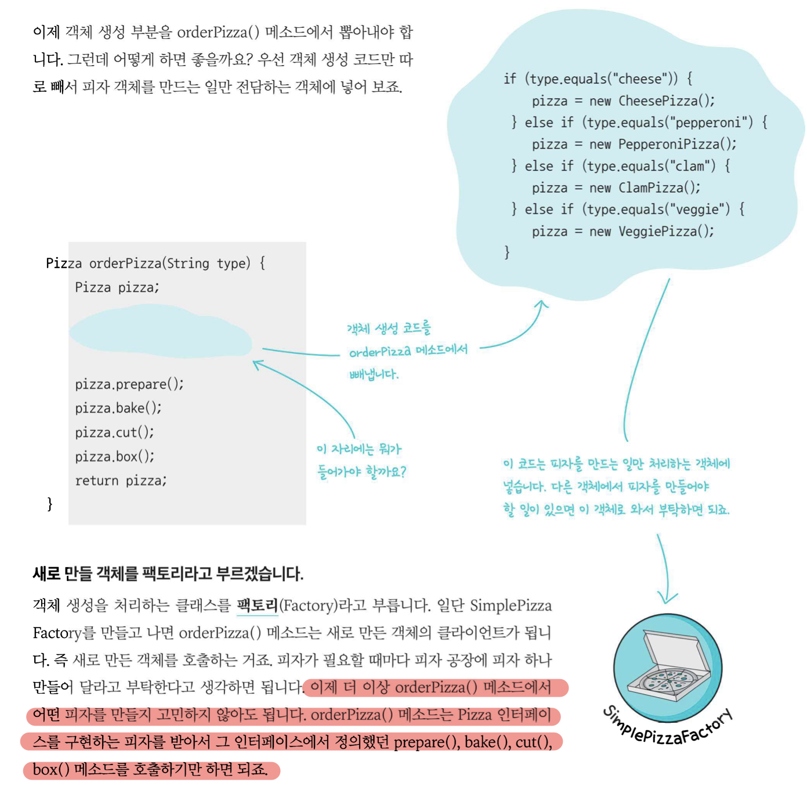

<br/>

-3) 2)에서 빼낸 바뀌는 부분을 정의
``` java
  public class SimplePizzaFactory{
      
      public Pizza createPizza(String type){
          Pizza pizza = null;
          
          if(type.equals("cheese"){
              pizza = new CheesePizza();
          }
          else if(type.equals("pepperoni"){
              pizza = new PepperoniPizza();
          }
          else if(type.equals("clam"){
              pizza = new CheesePizza();
          }
          else if(type.equlas("veggie"){
              pizza = new VeggiePizza();
          }
          return pizza;
      }
     }

```
-> 피자객체생성 작업을 팩토리클래스로 캡슐화해놓으면 구현을 변경할때 <br> 팩토리 클래스 하나만 고치면 된다  
<br/>

-4) 2)에서 빼내고 남은 부분을 알맞게 수정


<br/>

-5) `SimplePizzaFactory`를 삭제하고 3가지 서로 다른 **팩토리**(`NYPizzaFactory`, `ChicagoPizzaFactory`, `CaliforniaPizzaFactory`)를<br> 만든다음, PizzaStore에서 적당한 팩토리를 사용하도록 하는 방법


``` java
  //NYPizzaFactory
  NYPizzaFactory nyFactory = new NYPizzaFactory();
  PizzaStore nyStore = new PizzaStore(nyFactory);
  nyStore.orderPizza("Veggie");
  
  //ChicagoPizzaFactory
  ChicagoPizzaFactory chicagoFactory = new ChicagoPizzaFactory();
  PizzaStore chicagoStore = new PizzaStore(chicagoFactory);
  chicagoStore.orderPizza("Veggie");

```
- 하지만, `create()`를 서로 다른 팩토리 상 에서 구현하다 보니 <br>굽는방식이 달라진다던가, 이상하게 생긴 피자상자를 쓰는 일도 발생하였다
<br> - 이유를 생각해 봤을 때, `PizzaStore`의 역할을 더 구체화할려는 것 같다
- 그래서, PizzaStore와 피자제작코드(`create()`)를 하나로 묶어주는 프레임워크를 만들어야 한다

<br/>

-6) 피자가게 프레임워크 만들기

- `createPizza()`메소드를 `PizzaStore`에 다시 넣는다
  - `PizzaStore`와 피자 제작 코드 전체를 하나로 묶어주는 프레임워크를 만든다
  - *`orderPizza()`메소드는 어떤 스타일의 피자가 만들어졌는지 전혀 알지 못한다
<br/>

-7) `PizzaStore`의 서브클래스 구현


- **피자의 종류는 어떤 서브클래스를 선택했느냐**에 따라 결정된다
- 이로써, 구상클래스 인스턴스 만드는 일을 하나의 객체가 전부 처리하는 방식(ex:`ChicagoPizzaFactory`)에서 <br> **일련의 서브클래스(`NYStylePizzaStore`)가 처리하는 방식으로 바뀌었다**
- 팩토리 메서드


-8) `Pizza class`


-9) 구상 서브 클래스


-9-1) **Test**


  

***주문순서**  
- 01 : 철수와 영희가 있을 때, 철수는 `ChicagoPizzaStore인스턴스`를 영희는 `NYPizzaStore인스턴스`를 만든다
- 02 : `PizzaStore`가 만들어지면 각각 `orderPizza()`를 호출해야 한다. <br> 이 때, 인자를 써서 원하는 피자메뉴를 알려줘야 한다.
- 03 : 피자를 만들때에는 `createPizza()`메소드가 호출되는데 이 메소드는 `PizzaStore`서브클래스에 정의 되어 있다
<br> 어떤 서브클래스를 쓰든지 `Pizza`객체가 `orderPizza()`메소드로 리턴된다
- 04 : `orderPizza()`메소드는 어떤 스타일의 피자가 만들어졌는지 전혀 알지 못한다
  - 하지만, 피자라는 건 알고있어서 그 피자를 굽고,자르고,포장하는 작업을 완료한다
<br/>
  
***주문순서 그림**  


### +추상팩토리 패턴 사용

- 원재료 품질 관리 방법
  - 모든 피자는 같은 구성요소(반죽,소스,치즈)를 이용하지만 지역마다 각 구성요소를 다른종류로 구현한다

-10) 원재료 생산 팩토리 인터페이스
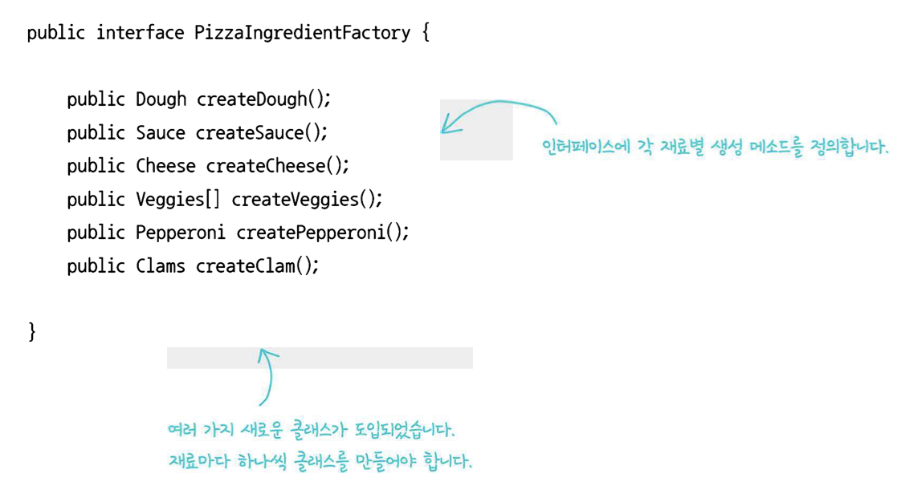

-11) 뉴욕 원재료 팩토리 만들기
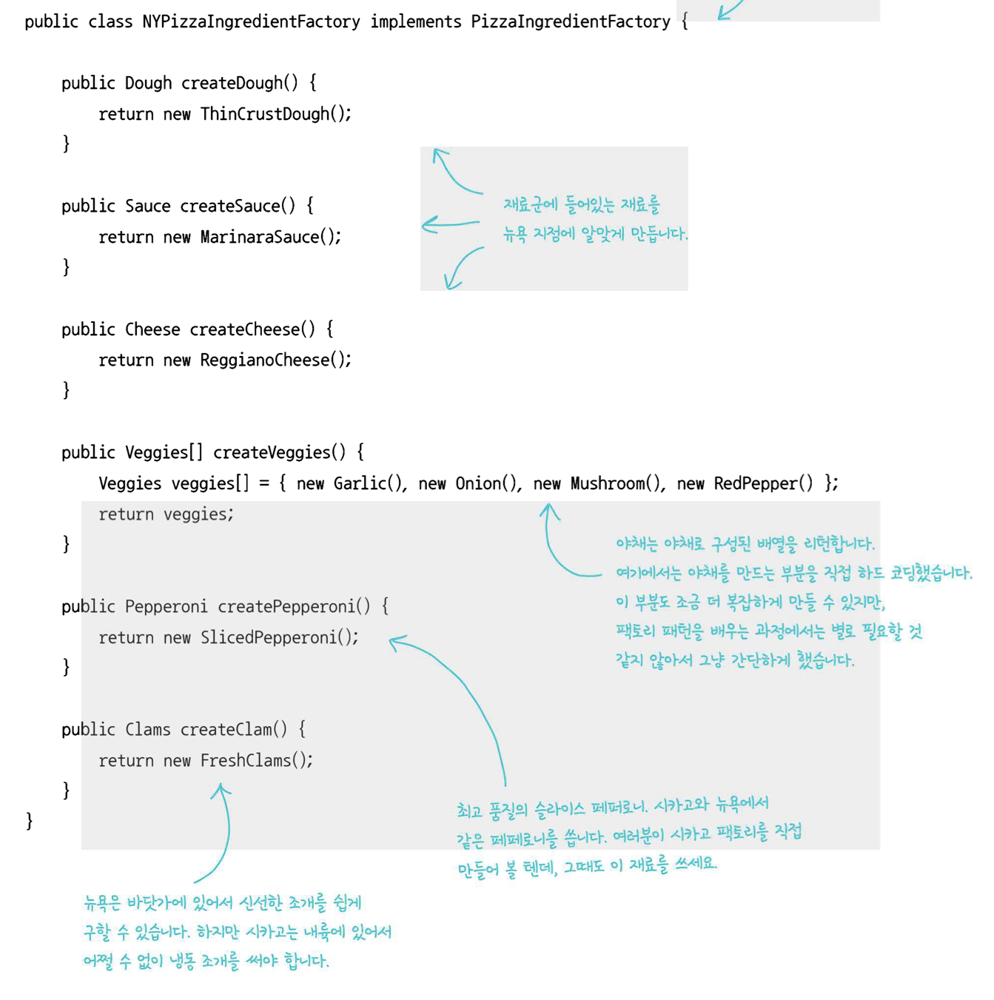

-12) Pizza 클래스 변경
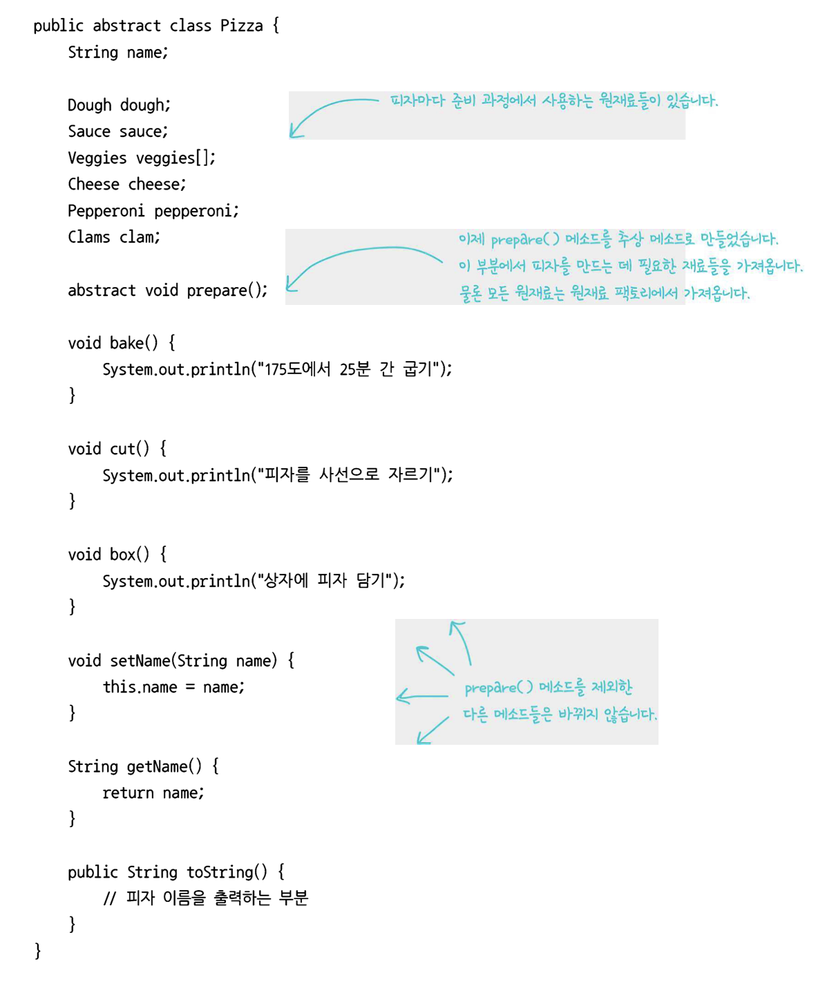

-13) 치즈피자 코드 예시
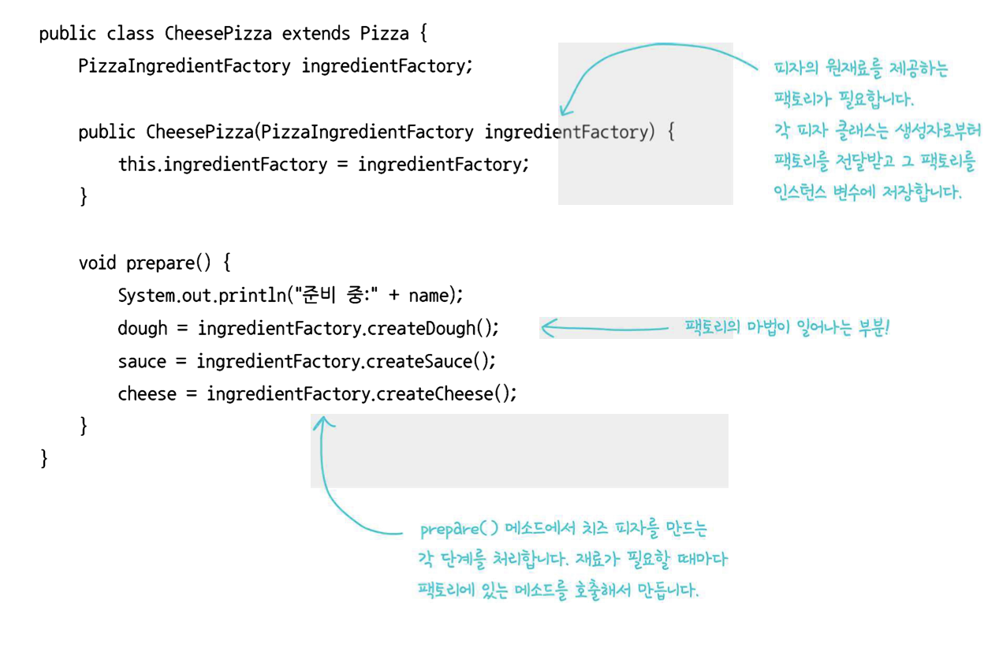

-14) NYPizzaStore클래스
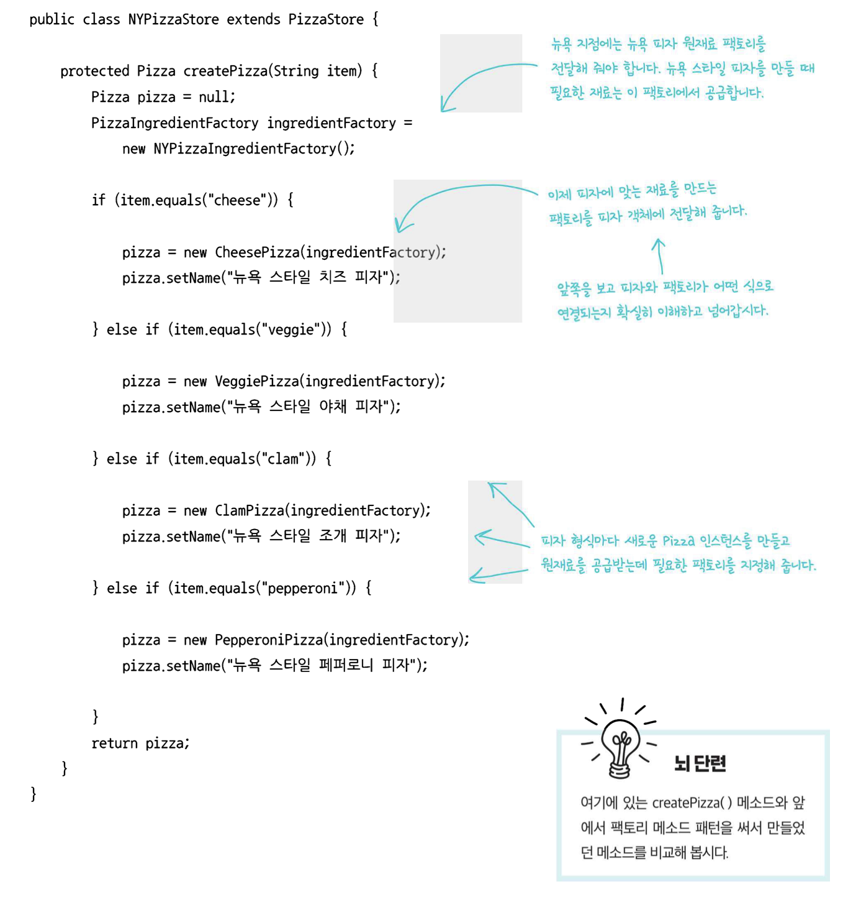


--------------------------------------
## <간단한 팩토리>


-> 디자인패턴이라기 보다는 프로그래밍에서 자주 쓰이는 관용구에 가깝다<br> 말 그대로 간단히 구성된 팩토리를 의미한다.(서브클래스 이용X)


<br/>


__[✏️여기서 잠깐!]__

우리는 **#데코레이터 패턴** 을 공부하면서 **객체지향의 기초** 와 **객체지향의 원칙** 을 공부했었다

<br/>

### <📦객체지향의 기초>
- 추상화
- 캡슐화
- 다형성
- 상속


<br/>

### <📦객체지향의 원칙(🍀디자인원칙🍀)>
- 바뀌는 부분은 캡슐화한다. -> **관리의 용이성**
  - 달라지는 부분과 달라지지 않는 부분을 분리
- 상속보다는 구성을 활용한다 -> **재사용성**
  - ex)`Interface I;` 변수사용 (상속을 사용하는 것이 아닌)
- 구현보다는 인터페이스에 맞춰서 프로그래밍 한다. -> **확장성**
  - GOF원칙, 인터페이스를 이용하자!
- 상호작용하는 객체 사이에서는 가능하면 느슨한 결합을 사용해야한다 -> **재사용성, 유연성**
  - 인터페이스를 구현하는 객체를 만들면 느슨한 결합을 만들기 수월<br>(확장성이 높고 의존성이 낮다)
- 클래스는 확장에는 열려 있어야 하지만 변경에는 닫혀 있어야 한다
  - OCP : 기존코드 수정없이 행동을 확장한다 (**행동을 상속받는 것이 아닌**)
  - **구성** (**슈퍼클래스인 인스턴스변수로 연결**)과 위임으로 객체의 행동 확장으로 실행중에 동적으로 행동 설정 가능<br>ex)`this.Beverage = Beverage;`
- +) 더 추가될 예정

---------------

## <팩토리 메서드 패턴>


- 간단한 팩토리(`SimplePizzaFactory`)와 비슷하지만 조금 다른 방법을 사용한다
- 구상클래스를 만들 때, `createPizza()`추상 메소드가 정의되어 있는 추상클래스(`PizzaStore`)를 확장해서 만든다   
간단한 팩토리 = 일회용 처방
<br>팩토리 메서드 패턴 = 여러번 재사용 가능(인터페이스에 맞춰서 코딩한 결과)

<br/>


---------------------------


## 디자인 원칙🌳🍀
- 의존성 뒤집기 원칙
  - 추상화된 것에 의존하게 만들고, 구상클래스에 의존하지 않게 만든다
  - "구현보다는 인터페이스에 맞춰서 프로그래밍한다"와 유사하지만, 추상화를 더 강조한 것.

- `PizzaStore 클래스`는 구수준 구성 요소, `Pizza 클래스`는 저수준 구성 요소
  - PizzaStore의 행동은 피자에 의해 정의되므로,
- **고수준 구성 요소**가 **저수준 구성 요소**에 의존하면 안된다
- 항상 추상화에 의존하게 만들어야 한다
- 결론: 구상클래스에 의존하지말고 그 구상클래스를 추상화한 인터페이스에 의존하자.
  - ex) NYStyleCheesePizza 에 의존하지말고 Pizza 에 의존하자

### 뒤집히기 전
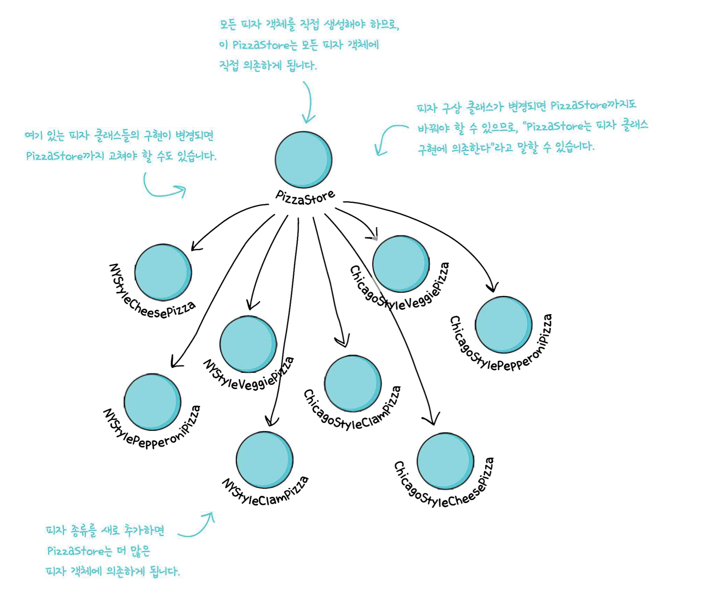

### 뒤집힌 후
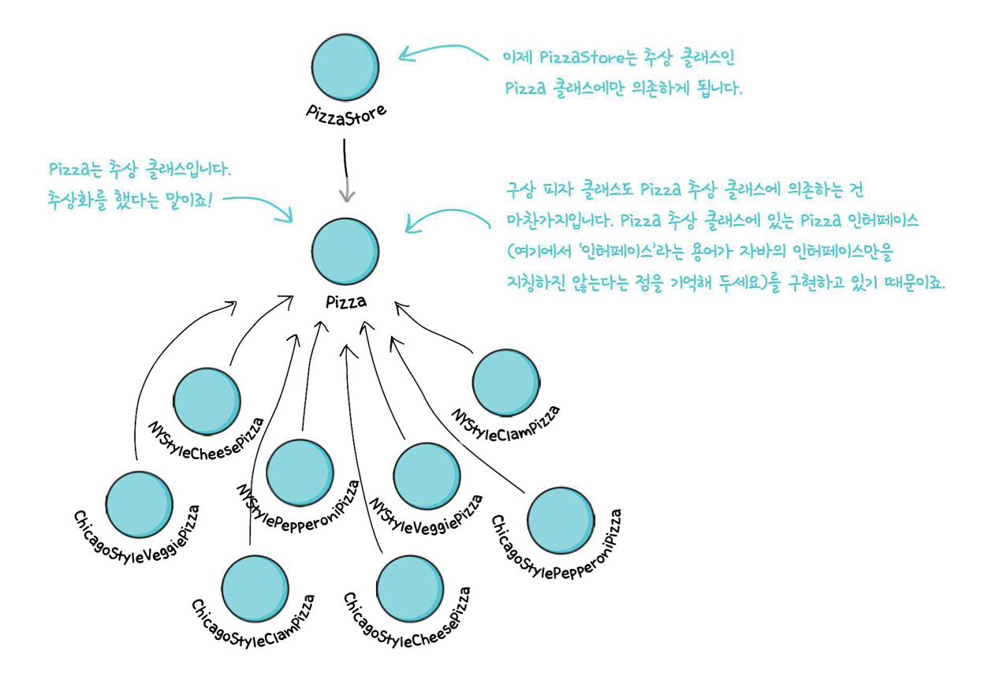
<br/>

---------------------------

### 🛠Class Diagram

### 팩토리 메서드 패턴
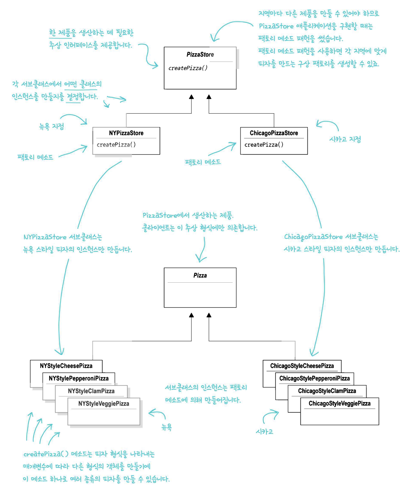

  
### 추상 팩토리 패턴
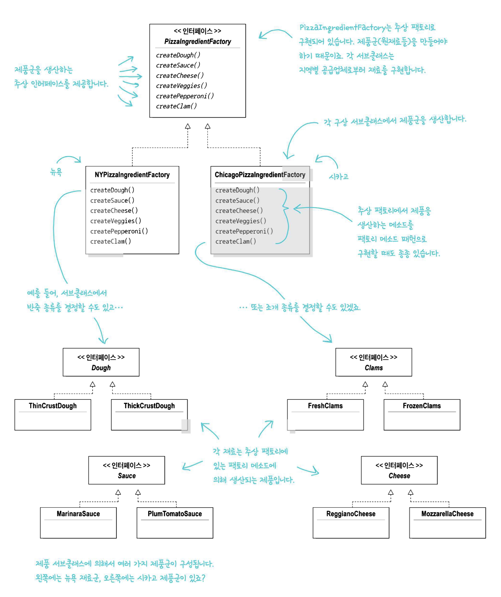
<br/>

------------------------

## 🔎 Q & A

Q.간단한 팩토리와 팩토리 메소드 패턴의 차이를 더 자세히 설명한다면?

<br/>

A. 예를 들어, 팩토리메서드패턴의 `orderPizza()`메소드는 피자를 만드는 일반적인 프레임워크를 제공한다<br>
그 프레임워크는 팩토리 메소드 피자 생성 구상 클래스를 만들었다.
<br>`PizzaStore`클래스의 서브 클래스를 만들 때, 어떤 구상 제품 클래스에서 리턴할 피자를 만들지를 결정한다
<br>이를 간단한 팩토리와 비교한다면 간단한 팩토리는 객체생성을 캡슐화 하기는 하지만, 팩토리 메소드(**인터페이스 중점 코딩**)만큼 유연하지 못하다
<br>(생성하는 제품을 마음대로 변경할 수 없기 때문에)


<br/>

-------------------

<br/>

## 🏴#팩토리 메서드 패턴, 추상 팩토리 패턴
- 객체 생성 코드를 전부 한 객체 또는 메소드에 넣으면 코드에서 중복되는 내용을 제거할 수 있고,
<br> 나중에 관리할 때도 한군데에만 신경쓰면 된다
- 객체 인스턴스를 만들 때 인터페이스만 있으면 된다
- 인터페이스를 바탕으로 프로그래밍 할 수 있어 **유연성**과 **확장성**이 뛰어나다
- **캡슐화**가 중점!
- **객체 생성을 캡슐화, 클라이언트와 구상클래스가 서로 분리된 유연한 디자인**
- **느슨한 결합을 도와준다**

<br/>

-----------------------

## 💥마치며..  

- 캡슐화: 특정한 기준을 가지고 서로 분리해서 생각하는것
- **인터페이스 중점 코딩**


__⭕상황에 맞게 변경할 수 있는 **유연한** 디자인을 만드는게 중요!!!__

<br/>

### <📦객체지향의 기초>
- 추상화
- 캡슐화
- 다형성
- 상속

<br/>


### <📦객체지향의 원칙(🍀디자인원칙🍀)>
- 바뀌는 부분은 캡슐화한다. -> **관리의 용이성**
    - 달라지는 부분과 달라지지 않는 부분을 분리
- 상속보다는 구성을 활용한다 -> **재사용성**
    - ex)`Interface I;` 변수사용 (상속을 사용하는 것이 아닌)
- 구현보다는 인터페이스에 맞춰서 프로그래밍 한다. -> **확장성**
    - GOF원칙, 인터페이스를 이용하자!
- 상호작용하는 객체 사이에서는 가능하면 느슨한 결합을 사용해야한다 -> **재사용성, 유연성**
    - 인터페이스를 구현하는 객체를 만들면 느슨한 결합을 만들기 수월<br>(확장성이 높고 의존성이 낮다)
- 클래스는 확장에는 열려 있어야 하지만 변경에는 닫혀 있어야 한다
  - OCP : 기존코드 수정없이 행동을 확장한다 (**행동을 상속받는 것이 아닌**) 
  - **구성** (**슈퍼클래스인 인스턴스변수로 연결**)과 위임으로 객체의 행동 확장으로 실행중에 동적으로 행동 설정 가능<br>ex)`this.Beverage = Beverage;`
- 추상화된 것에 의존하게 만들고 구상클래스에 의존하지 않게 만든다
  - 구상클래스가 아닌 추상클래스와 인터페이스에 맞춰서 코딩 -> 느슨한결합, 캡슐화
  - `Pizza인터페이스(or추상클래스)`라는 추상에 의존하게 만들자
- +) 더 추가될 예정


<br/>


## 🔑 -> (#팩토리 패턴도 마찬가지로)모든 패턴들이 <br>객체지향의 기본개념과 원칙에 의존한다

