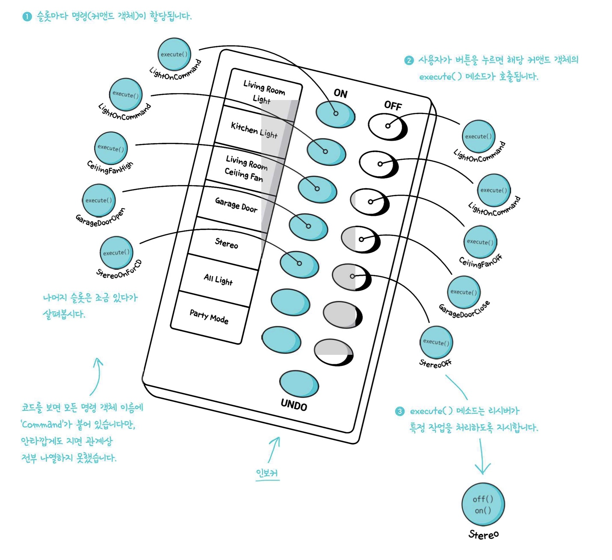

# 💈디자인 패턴 (#싱글턴 패턴)

  

### ☑️싱글턴 패턴에 대해 알아보자  
<br/>

## 📌 일련의 행동을 특정 리시버와 연결함으로써 요청을 캡슐화 한다
## 📌 어떤 작업을 요청하는 쪽과 그 작업을 처리하는 쪽을 분리할 수 있다

  
<br/>

## <정의> 


- 행동과 리시버를 한 객체에 넣고, `execute()`라는 메소드 하나만 외부에 공개하는 방법을 써야한다
  - 이 메서드 호출에 따라 리시버에서 일련의 작업을 처리합니다
- 밖에서 볼 때는 어떤 객체가 리시버 역할을 하는지, 그 리시버가 어떤 일을 하는지 알 수 없다.<br> 그냥 `execute()`메서드를 호출하면 해당요청이 처리된다는 사실만 알 수 있다
  - 캡슐화의 장점
<br/>


--------------

<br/>


## <커맨드 패턴 요소>   


<br/>

```java
public static void main(String[] args) {
        SimpleRemoteControl remote = new SimpleRemoteControl(); //인보커 객체 생성
        Light light = new Light();  //리시버 객체 생성
        GarageDoor garageDoor = new GarageDoor(); //리시버 객체 생성
        LightOnCommand lightOn = new LightOnCommand(light); //커맨드 객체 생성
        GarageDoorOpenCommand garageDoorOn = new GarageDoorOpenCommand(garageDoor); //커맨드 객체 생성

        remote.setCommand(lightOn); //인보커가 커맨드 호출
        remote.buttonWasPressed();  //커맨드 내부의 execute 호출
        remote.setCommand(garageDoorOn);  //인보커가 커맨드 호출
        remote.buttonWasPressed();  //커맨드 내부의 execute 호출
    }
```


<br/>


--------------------------------------


### 🛠Class Diagram
  
 <br/> 


<br/>


--------------

<br/>


## <커맨드 패턴 구체화 하기>   



<br/>

-----------------------

## <람다를 이용한 코드>


- 구상 커맨드 객체를 람다 표현식으로 바꾸면 구상 커맨드 클래스(`LightOnCommand`, `LightOffCommand` 등) 모두 지워도 된다
- 리모컨 어플리케이션에 들어있는 클래스를 22개에서 9개로 줄일 수 있다

<br/>

**이 방법은 Command 인터페이스에 추상 메소드가 하나 뿐일때만 사용 할 수 있다**

<br/>

----------------

## <커맨드패턴 구분하기>


<br/>

----------------

## 💥마치며..  

- 커맨드 패턴 : 메서드를 커맨드 객체로 캡슐화 할 수 있는 패턴
  - **요청하는 객체와 요청을 수행하는 객체를 분리하고 싶다면 사용**
  - **이러한 요청을 큐에 저장하거나 로그로 기록하거나 작업 취소기능을 사용 할 수 있다**

<br/>

__⭕상황에 맞게 변경할 수 있는 **유연한** 디자인을 만드는게 중요!!!__

<br/>

### <📦객체지향의 기초>
- 추상화
- 캡슐화
- 다형성
- 상속

<br/>


### <📦객체지향의 원칙(🍀디자인원칙🍀)>
- 바뀌는 부분은 캡슐화한다. -> **관리의 용이성**
    - 달라지는 부분과 달라지지 않는 부분을 분리
- 상속보다는 구성을 활용한다 -> **재사용성**
    - ex)`Interface I;` 변수사용 (상속을 사용하는 것이 아닌)
- 구현보다는 인터페이스에 맞춰서 프로그래밍 한다. -> **확장성**
    - GOF원칙, 인터페이스를 이용하자!
- 상호작용하는 객체 사이에서는 가능하면 느슨한 결합을 사용해야한다 -> **재사용성, 유연성**
    - 인터페이스를 구현하는 객체를 만들면 느슨한 결합을 만들기 수월<br>(확장성이 높고 의존성이 낮다)
- 클래스는 확장에는 열려 있어야 하지만 변경에는 닫혀 있어야 한다
  - OCP : 기존코드 수정없이 행동을 확장한다 (**행동을 상속받는 것이 아닌**) 
  - **구성** (**슈퍼클래스인 인스턴스변수로 연결**)과 위임으로 객체의 행동 확장으로 실행중에 동적으로 행동 설정 가능<br>ex)`this.Beverage = Beverage;`
- 추상화된 것에 의존하게 만들고 구상클래스에 의존하지 않게 만든다
  - 구상클래스가 아닌 추상클래스와 인터페이스에 맞춰서 코딩 -> 느슨한결합, 캡슐화
  - `Pizza인터페이스(or추상클래스)`라는 추상에 의존하게 만들자
- +) 더 추가될 예정


<br/>


