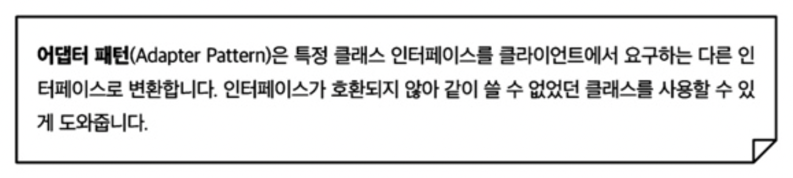
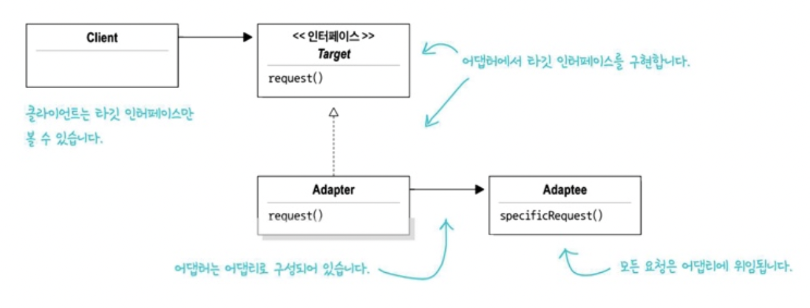
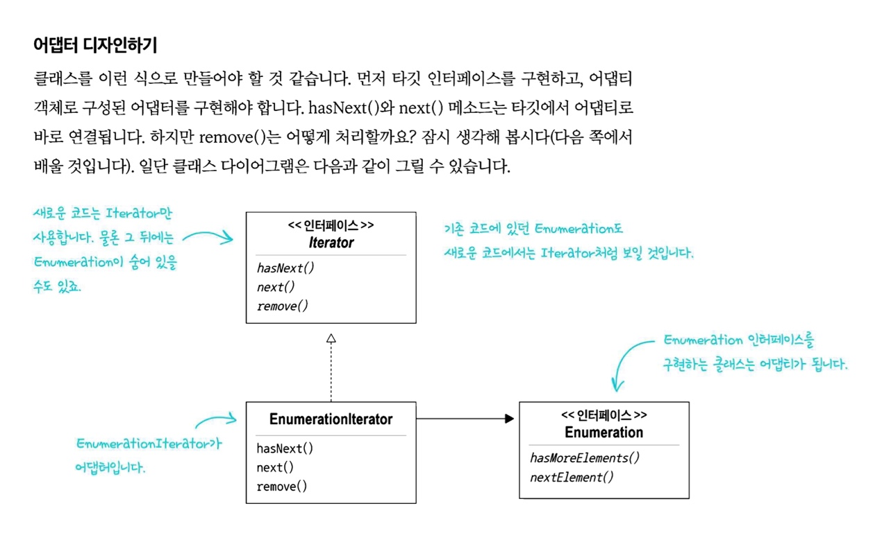
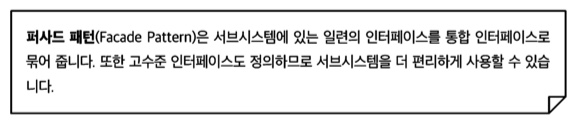
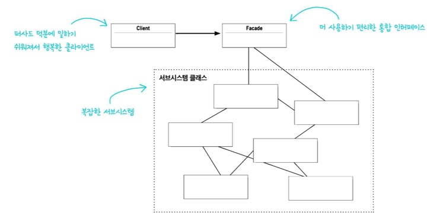

# 💈디자인 패턴 (#어댑터 패턴과 퍼사드 패턴) - 컨버터  
- **어댑터**는 객체를 감싸서 인터페이스를 바꾸는 용도로,<br> **데코레이터**는 객체를 감싸서 새로운 행동을 추가하는 용도로<br> **퍼사드**는 일련의 객체를 감싸서 단순하게 만드는 용도  

  

### ☑️어댑터 패턴과 퍼사드 패턴에 대해 알아보자  
<br/>

## 📌 어댑터 패턴을 이용하면 호환되지 않는 인터페이스를 사용하는 클라이언트를 그대로 활용 가능하다
## 📌 어댑터 패턴은 인터페이스를 변경해서 클라이언트에서 필요로 하는 인터페이스로 적응시키는 용도로 쓰인다<br> 퍼사드 패턴은 어떤 서브시스템에 대한 간단한 인터페이스를 제공하는 용도로 쓰인다

  
<br/>

## <정의> 



- Client - 220V (오리를 생각)
- Adpater - Converter(220V -> 110V)
- Adaptee - 110V





--------------


## <커맨드 패턴 요소>   

<br/>

```java
//Adapter
public class TurkeyAdapter implements Duck {
  Turkey turkey;

  public TurkeyAdapter(Trukey turkey){
    this.turkey = turkey;
  }

  public void quack(){
    turkey.gobble();
  }

  public void fly(){
    turkey.fly();
  }
}
```


<br/>




--------------------------------------

## <정의>
- 퍼사드 : 겉모양이나 외관이라는 뜻




----------------

## 💥마치며..  

- **어댑터 패턴, 데코레이터 패턴, 퍼사드 패턴** :
<br> 어댑터는 객체를 감싸서 인터페이스를 바꾸는 용도로,<br> 데코레이터는 객체를 감싸서 새로운 행동을 추가하는 용도로<br> 퍼사드는 일련의 객체를 감싸서 단순하게 만드는 용도

- 클라이언트와 시스템 사이의 결합을 더 느슨하게 만들어주는 패턴.

<br/>

__⭕상황에 맞게 변경할 수 있는 **유연한** 디자인을 만드는게 중요!!!__

<br/>

### <📦객체지향의 기초>
- 추상화
- 캡슐화
- 다형성
- 상속

<br/>


### <📦객체지향의 원칙(🍀디자인원칙🍀)>
- 바뀌는 부분은 캡슐화한다. -> **관리의 용이성**
    - 달라지는 부분과 달라지지 않는 부분을 분리
- 상속보다는 구성을 활용한다 -> **재사용성**
    - ex)`Interface I;` 변수사용 (상속을 사용하는 것이 아닌)
- 구현보다는 인터페이스에 맞춰서 프로그래밍 한다. -> **확장성**
    - GOF원칙, 인터페이스를 이용하자!
- 상호작용하는 객체 사이에서는 가능하면 느슨한 결합을 사용해야한다 -> **재사용성, 유연성**
    - 인터페이스를 구현하는 객체를 만들면 느슨한 결합을 만들기 수월<br>(확장성이 높고 의존성이 낮다)
- 클래스는 확장에는 열려 있어야 하지만 변경에는 닫혀 있어야 한다
  - OCP : 기존코드 수정없이 행동을 확장한다 (**행동을 상속받는 것이 아닌**) 
  - **구성** (**슈퍼클래스인 인스턴스변수로 연결**)과 위임으로 객체의 행동 확장으로 실행중에 동적으로 행동 설정 가능<br>ex)`this.Beverage = Beverage;`
- 추상화된 것에 의존하게 만들고 구상클래스에 의존하지 않게 만든다
  - 구상클래스가 아닌 추상클래스와 인터페이스에 맞춰서 코딩 -> 느슨한결합, 캡슐화
  - `Pizza인터페이스(or추상클래스)`라는 추상에 의존하게 만들자
- 여러클래스가 복잡하게 얽혀있어서 한부분의 수정으로 줄줄이 수정하게 되는 것을 막자
  - 최소지식 원칙(**객체사이의 상호작용은 될 수 있으면 아주 가까운경우에만 허용**) (**밑에는 원칙을 지키지 않은 경우**)
  - 객체가 대신 요청하도록 하자.(각각의 객체에 역할과 책임을 분배하자)
    ```java
    public float getTemp(){
      return station.getThermometer().getTemperature();
    }
    ```
- +) 더 추가될 예정


<br/>


