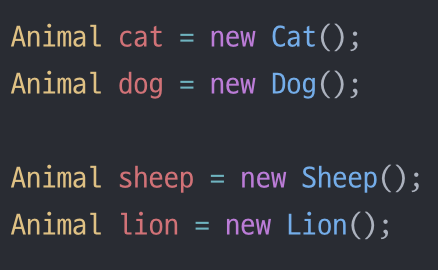

# 💈디자인 패턴 (#템플릿 메서드 패턴) - 커피와 홍차 만드는 과정이 비슷  
- 템플릿 메서드는 알고리즘의 각 단계를 정의하며,<br> 서브클래스에서 일부단계를 구현할 수 있도록 유도한다
- 템플릿 메서드 패턴과 전략패턴 모두 알고리즘을 캡슐화 하는 패턴이지만,<br> 전략 패턴은 **상속**을 템플릿메서드 패턴은 **구성**을 사용한다
  

### ☑️템플릿 메서드 패턴에 대해 알아보자  
<br/>

## 📌 공통으로 사용되는 알고리즘의 기본 뼈대를 일반화 하여 사용한다.

  
<br/>

## <정의> 


--------------


## <템플릿 메서드 패턴 요소>   

<br/>

```java
abstract class AbstractClass{
  final void templateMethod() {
    primitiveOperation1();
    primitiveOperation2();
    concreteOperation();
  }

  abstract void primitiveOperation1();

  abstract void primitiveOperation2();

  void concreateOperation() {
    //Code
  }
  // abstract 클래스를 상속받은 하위 클래스는 abstract 메서드는 필수로 오버라이딩해야하고 나머지는 선택
  // interface 를 구현한 하위 클래스(구상 클래스)는 일반 메서드는 필수로 오버라이딩 해야한다
  // static 메서드는 오버라이딩 불가, default 메서드는 오버라이딩 가능(선택)
}
```


----------------

## 💥마치며..  

- **템플릿 메서드 패턴** : 알고리즘의 구조는 그대로 유지하면서 알고리즘의 특정단계를 서브클래스에서 재정의 할 수도 있다
- **의존성이 전략패턴 보다 크다**
  - 알고리즘의 일부를 슈퍼클래스에서 구현한 메서드에 의존해야한다
  - 전략패턴은 어떤것에도 의존하지 않는다는 장점이 있다

<br/>

__⭕상황에 맞게 변경할 수 있는 **유연한** 디자인을 만드는게 중요!!!__

<br/>

### <📦객체지향의 기초>
- 추상화
- 캡슐화
- 다형성
- 상속

<br/>


### <📦객체지향의 원칙(🍀디자인원칙🍀)>
- 바뀌는 부분은 캡슐화한다. -> **관리의 용이성**
    - 달라지는 부분과 달라지지 않는 부분을 분리
- 상속보다는 구성을 활용한다 -> **재사용성**
    - ex)`Car car = new Car;` 변수사용 (상속을 사용하는 것이 아닌)
    - `is a`로 표현하는 것이아닌 `has a` 객체가 단순하게 참조하여 사용하는 것
    ``` java
    public class Print{
      private Car car = new Car();
    }
    ```
- 구현보다는 인터페이스에 맞춰서 프로그래밍 한다. -> **확장성**
    - GOF원칙, 인터페이스를 이용하자!
- 상호작용하는 객체 사이에서는 가능하면 느슨한 결합을 사용해야한다 -> **재사용성, 유연성**
    - 인터페이스를 구현하는 객체를 만들면 느슨한 결합을 만들기 수월<br>(확장성이 높고 의존성이 낮다)
- 클래스는 확장에는 열려 있어야 하지만 변경에는 닫혀 있어야 한다
  - OCP : 기존코드 수정없이 행동을 확장한다 (**행동을 상속받는 것이 아닌**) 
  - 잘못된 OCP

    

  - OCP
  
    
    
  - **구성** (**슈퍼클래스인 인스턴스변수로 연결**)과 위임으로 객체의 행동 확장으로 실행중에 동적으로 행동 설정 가능<br>ex)`this.Beverage = Beverage;`
- 추상화된 것에 의존하게 만들고 구상클래스에 의존하지 않게 만든다
  - 구상클래스가 아닌 추상클래스와 인터페이스에 맞춰서 코딩 -> 느슨한결합, 캡슐화
  - `Pizza인터페이스(or추상클래스)`라는 추상에 의존하게 만들자
- 여러클래스가 복잡하게 얽혀있어서 한부분의 수정으로 줄줄이 수정하게 되는 것을 막자
  - 최소지식 원칙(**객체사이의 상호작용은 될 수 있으면 아주 가까운경우에만 허용**) (**밑에는 원칙을 지키지 않은 경우**)
  - 객체가 대신 요청하도록 하자.(각각의 객체에 역할과 책임을 분배하자)
    ```java
    public float getTemp(){
      return station.getThermometer().getTemperature();
    }
    ```
- 저수준 구성요소가 시스템에 접속할 수는 있지만, 언제 어떻게 사용될지는 고수준 요소가 결정
  - 할리우드 원칙(고수준이 저수준에게 필요할 때 연락주겠다, 먼저 연락하지 마라)
  - 고수준(`상위클래스`), 저수준(`하위클래스`)
- +) 더 추가될 예정


<br/>


