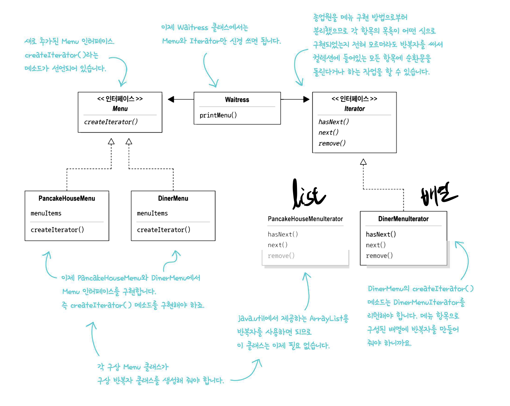
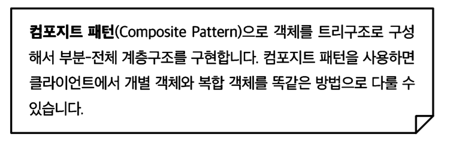
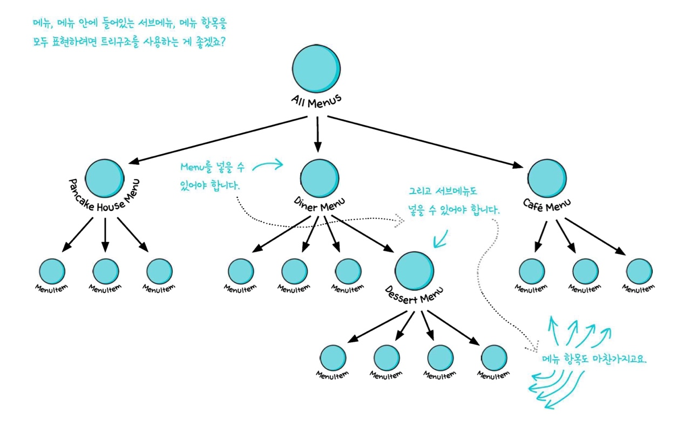
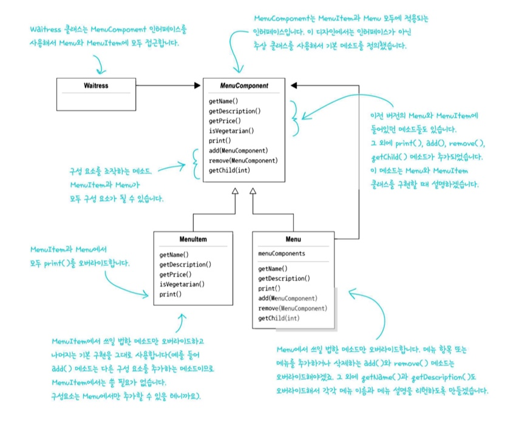

# 💈디자인 패턴 (#반복자 패턴과 컴포지트 패턴) - 반복자는 iterator로 추상화, 컴포지트패턴 = 폴더
- 반복자 패턴이 `Iterator`인터페이스에 의존한다
- 컴포지트 패턴은 재귀형태로 구성된다

### ☑️반복자 패턴, 컴포지트 패턴에 대해 알아보자  
<br/>

## 📌 집합체 내에서 어떤 식으로 일이 처리되는지 전혀 모르는 상태에서<br> 그 안에 들어있는 모든 항목을 대상으로 반복작업을 수행 할 수 있다 -> 반복자 패턴
## 📌 부분-전체 계층구조 -> 컴포지트 패턴

  
<br/>

## <정의> 





--------------


## <반복자 패턴 요소>   

<br/>

```java
public class DinerMenuIterator implements Iterator<MenuItem>{
  MenuItem[] items;
  int position = 0;

  public DinerMenuIterator(MenuItem[] items){
    this.items = items;
  }
  public MenuItem next(){
    ...
  }
  public boolean hasNext(){
    ...
  }
  public void remove(){
    throw new UnsupportedOperationException("메뉴항목은 지우면 안됩니다");
  }
}
```

--------------


## <정의> 






- 복합객체(`composite`)에는 구성요소(`component`)가 들어있다
- 컴포지트 패턴에서는 계층구조를 관리하는 일과 메뉴관련 작업을 처리한다
  - 한 클래스가 2가지의 일을 한다
  - 단일 역할 원칙을 깨는 대신 투명성을 확보하는 패턴
    - 어떤원소가 복합객체인지 어떤 객체가 잎인지 투명하게 보인다
      
    - 상황에 따라 원칙을 적절하게 사용해야한다

  ``` java
  public class Menu extends MenuComponent {
    List<MenuComponent> menuComponents = new ArrayList<MenuComponent>();
    String name;
    String description;

    ...
  }
  ```


----------------

## 💥마치며..  

- **반복자 패턴** : 컬렉션의 구현 방법을 노출하지 않으면서 집합체 내의 모든 항목에 접근하는 방법
- **컴포지트 패턴** : 객체를 트리구조로 구성해서 부분-전체 계층구조를 구현

- 전략패턴 : 바뀔 수 있는 행동을 캡슐화하고 어떤 행동을 적용할지 위임해서 결정한다
- 어댑터 패턴: 하나 이상의 클래스의 인터페이스를 변환한다
- 반복자 패턴 : 컬렉션의 구현을 드러내지 않으면서도 컬렉션에 있는 모든 객체를 대상으로 반복 작업 할 수 있다
- 퍼사드 패턴 : 클래스의 인터페이스를 단순화 한다
- 컴포지트 패턴 : 클라이언트에서 객체 컬렉션과 개별 객체를 똑같은 식으로 처리할 수 있다
- 옵저버 패턴 : 어떤 상태가 변경되었을때 일련의 객체에게 연락 할 수 있다
  

<br/>

__⭕상황에 맞게 변경할 수 있는 **유연한** 디자인을 만드는게 중요!!!__

<br/>

### <📦객체지향의 기초>
- 추상화
- 캡슐화
- 다형성
- 상속

<br/>


### <📦객체지향의 원칙(🍀디자인원칙🍀)>
- 바뀌는 부분은 캡슐화한다. -> **관리의 용이성**
    - 달라지는 부분과 달라지지 않는 부분을 분리
- 상속보다는 구성을 활용한다 -> **재사용성**
    - ex)`Car car = new Car;` 변수사용 (상속을 사용하는 것이 아닌)
    - `is a`로 표현하는 것이아닌 `has a` 객체가 단순하게 참조하여 사용하는 것
    ``` java
    public class Print{
      private Car car = new Car();
    }
    ```
- 구현보다는 인터페이스에 맞춰서 프로그래밍 한다. -> **확장성**
    - GOF원칙, 인터페이스를 이용하자!
- 상호작용하는 객체 사이에서는 가능하면 느슨한 결합을 사용해야한다 -> **재사용성, 유연성**
    - 인터페이스를 구현하는 객체를 만들면 느슨한 결합을 만들기 수월<br>(확장성이 높고 의존성이 낮다)
- 클래스는 확장에는 열려 있어야 하지만 변경에는 닫혀 있어야 한다
  - OCP : 기존코드 수정없이 행동을 확장한다 (**행동을 상속받는 것이 아닌**) 
  - 잘못된 OCP

    

  - OCP
  
    
    
  - **구성** (**슈퍼클래스인 인스턴스변수로 연결**)과 위임으로 객체의 행동 확장으로 실행중에 동적으로 행동 설정 가능<br>ex)`this.Beverage = Beverage;`
- 추상화된 것에 의존하게 만들고 구상클래스에 의존하지 않게 만든다
  - 구상클래스가 아닌 추상클래스와 인터페이스에 맞춰서 코딩 -> 느슨한결합, 캡슐화
  - `Pizza인터페이스(or추상클래스)`라는 추상에 의존하게 만들자
- 여러클래스가 복잡하게 얽혀있어서 한부분의 수정으로 줄줄이 수정하게 되는 것을 막자
  - 최소지식 원칙(**객체사이의 상호작용은 될 수 있으면 아주 가까운경우에만 허용**) (**밑에는 원칙을 지키지 않은 경우**)
  - 객체가 대신 요청하도록 하자.(각각의 객체에 역할과 책임을 분배하자)
    ```java
    public float getTemp(){
      return station.getThermometer().getTemperature();
    }
    ```
- 저수준 구성요소가 시스템에 접속할 수는 있지만, 언제 어떻게 사용될지는 고수준 요소가 결정
  - **할리우드 원칙(고수준이 저수준에게 필요할 때 연락주겠다, 먼저 연락하지 마라)**
  - 고수준(`상위클래스`), 저수준(`하위클래스`)
- 어떤 클래스에서 맡고 있는 모든 역할은 나중에 코드 변화를 불러올 수 있다<br> 역할이 2개 이상 있으면 바뀔 수 있는 부분이 2개 이상이된다
  - 하나의 클래스는 하나의 역할만 맡아야 된다.
  - **단일 역할 원칙**
  - 응집도가 높아야 한다
    - 한 클래스 또는 모듈이 특정 목적이나 역할을<br> 얼마나 일관되게 지원하는지를 나타내는 척도
- +) 더 추가될 예정


<br/>


