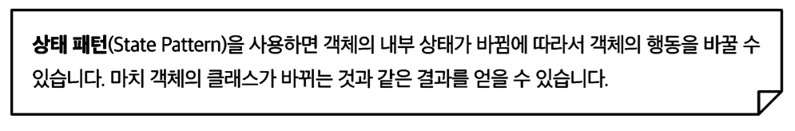
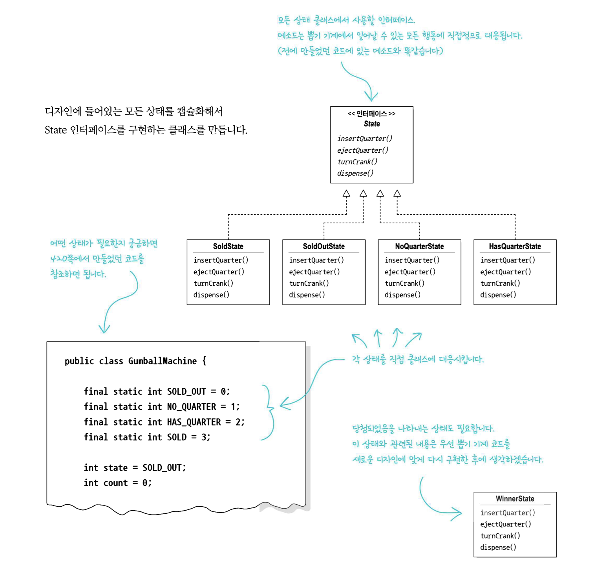
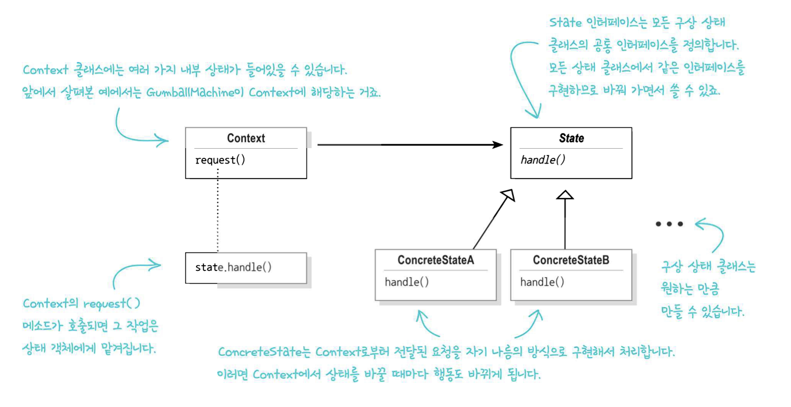
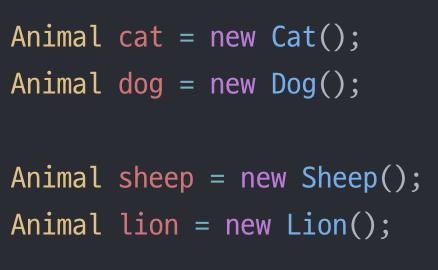

# 💈디자인 패턴 (#상태패턴) - 상태가 여러개인 경우 상태를 클래스화
- **상태** 또한 **단일 역할 원칙**을 준수해야 한다

### ☑️상태패턴에 대해 알아보자  
<br/>

## 📌 각 상태의 행동을 별개의 클래스로 국지화한다

  
<br/>

## <정의> 








--------------


## <상태 패턴 요소>   

<br/>

```java
public class NoQuarterState implements State {
  GumballMachine gumballMachine;

  public NoQuarterState(GumballMachine gumballMachine){
    this.gumballMachine = gumballMachine;
  }

  public void insertQuarter(){
    System.out.println("동전을 넣으셨습니다");
    gumballMachine.setState(gumballMachine.getHasQuarterState()); //상태를 변경
  }
  public void ejectQuarter(){
    ...
  }
  ...
}

public class GumballMachine {
  State soldOutState;
  State noQuarterState;
  State hasQuarterState;
  State soldState;

  State state;
  int count = 0;

  public GumballMachine(int numberGumballs){
    soldOutState = new SoldOutState(this);
    noQuarterState = new NoQuarterState(this);
    hasQuarterState = new HasQuarterState(this);
    soldState = new SoldState(this);

    this.count = numberGumballs;
    if(numberGumballs > 0){
      state = noQuarterState;
    } else {
      state = soldOutState;
    }
  }

  ...
  getter(), setter()
}


```

- 관리하기 힘든 if선언문들을 없앨 수 있다(상태를 클래스화 함으로써)
- 각 상태를 변경에는 닫혀있고, `GumballMachine`클래스는 새로운 상태 클래스를 추가하는 확장에는 열려있도록 고쳤다(`OCP`)
- 뽑기기계가 `NoQurterState`에 있을 때 동전을 넣는 경우와<br> `HasQuarterState`에 있을때 동전을 넣는 경우에 각각 다른 경우가 나온다


----------------

## 💥마치며..  

- **상태패턴** : 내부 상태가 바뀜에 따라 객체의 행동이 바뀔 수 있도록 해준다 <br> 마치 객체의 클래스가 바뀌는 것 같은 결과를 얻을 수 있다

- 상태패턴 : `Context`(`GumballMachine`)에서 여러 상태 객체 중 한 객체에게 모든 행동을 맡기게 되고 그 객체의 내부상태에 따라 현재 상태를 나타내는 객체가 변경
  - 상태를 기반으로 하는 행동을 캡슐화하고, 행동을 현재 상태에게 위임한다

- 전략패턴 : 클라이언트가 `Context`객체에게 어떤 전략 객체를 사용할지를 지정해준다
  - 바꿔 쓸 수 있는 행동을 캡슐화한 다음, 실제 행동은 다른 객체에 위임한다
  
- 템플릿 메서드 패턴 : 알고리즘의 각 단계를 구현하는 방법을 서브클래스에서 구현한다


<br/>

__⭕상황에 맞게 변경할 수 있는 **유연한** 디자인을 만드는게 중요!!!__

<br/>

### <📦객체지향의 기초>
- 추상화
- 캡슐화
- 다형성
- 상속

<br/>


### <📦객체지향의 원칙(🍀디자인원칙🍀)>
- 바뀌는 부분은 캡슐화한다. -> **관리의 용이성**
    - 달라지는 부분과 달라지지 않는 부분을 분리
- 상속보다는 구성을 활용한다 -> **재사용성**
    - ex)`Car car = new Car;` 변수사용 (상속을 사용하는 것이 아닌)
    - `is a`로 표현하는 것이아닌 `has a` 객체가 단순하게 참조하여 사용하는 것
    ``` java
    public class Print{
      private Car car = new Car();
    }
    ```
- 구현보다는 인터페이스에 맞춰서 프로그래밍 한다. -> **확장성**
    - GOF원칙, 인터페이스를 이용하자!
- 상호작용하는 객체 사이에서는 가능하면 느슨한 결합을 사용해야한다 -> **재사용성, 유연성**
    - 인터페이스를 구현하는 객체를 만들면 느슨한 결합을 만들기 수월<br>(확장성이 높고 의존성이 낮다)
- 클래스는 확장에는 열려 있어야 하지만 변경에는 닫혀 있어야 한다
  - OCP : 기존코드 수정없이 행동을 확장한다 (**행동을 상속받는 것이 아닌**) 
  - 잘못된 OCP

    

  - OCP
  
    
    
  - **구성** (**슈퍼클래스인 인스턴스변수로 연결**)과 위임으로 객체의 행동 확장으로 실행중에 동적으로 행동 설정 가능<br>ex)`this.Beverage = Beverage;`
- 추상화된 것에 의존하게 만들고 구상클래스에 의존하지 않게 만든다
  - 구상클래스가 아닌 추상클래스와 인터페이스에 맞춰서 코딩 -> 느슨한결합, 캡슐화
  - `Pizza인터페이스(or추상클래스)`라는 추상에 의존하게 만들자
- 여러클래스가 복잡하게 얽혀있어서 한부분의 수정으로 줄줄이 수정하게 되는 것을 막자
  - 최소지식 원칙(**객체사이의 상호작용은 될 수 있으면 아주 가까운경우에만 허용**) (**밑에는 원칙을 지키지 않은 경우**)
  - 객체가 대신 요청하도록 하자.(각각의 객체에 역할과 책임을 분배하자)
    ```java
    public float getTemp(){
      return station.getThermometer().getTemperature();
    }
    ```
- 저수준 구성요소가 시스템에 접속할 수는 있지만, 언제 어떻게 사용될지는 고수준 요소가 결정
  - **할리우드 원칙(고수준이 저수준에게 필요할 때 연락주겠다, 먼저 연락하지 마라)**
  - 고수준(`상위클래스`), 저수준(`하위클래스`)
- 어떤 클래스에서 맡고 있는 모든 역할은 나중에 코드 변화를 불러올 수 있다<br> 역할이 2개 이상 있으면 바뀔 수 있는 부분이 2개 이상이된다
  - 하나의 클래스는 하나의 역할만 맡아야 된다.
  - **단일 역할 원칙**
  - 응집도가 높아야 한다
    - 한 클래스 또는 모듈이 특정 목적이나 역할을<br> 얼마나 일관되게 지원하는지를 나타내는 척도
- +) 더 추가될 예정


<br/>


