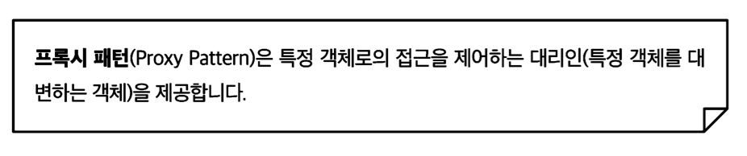
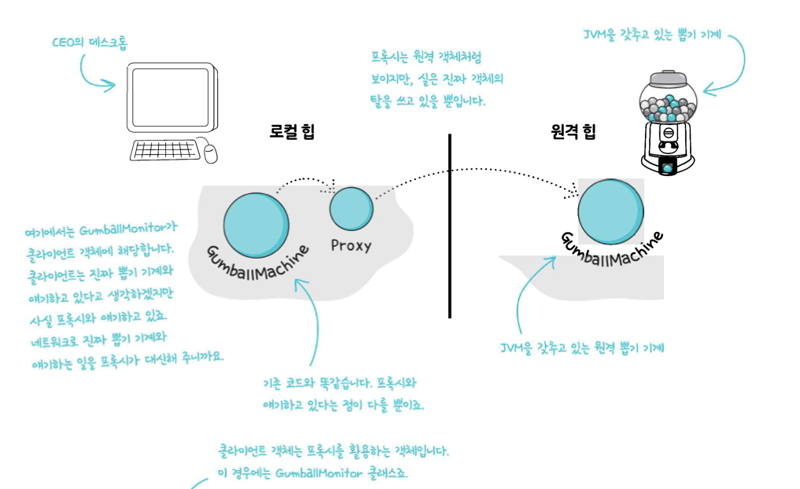
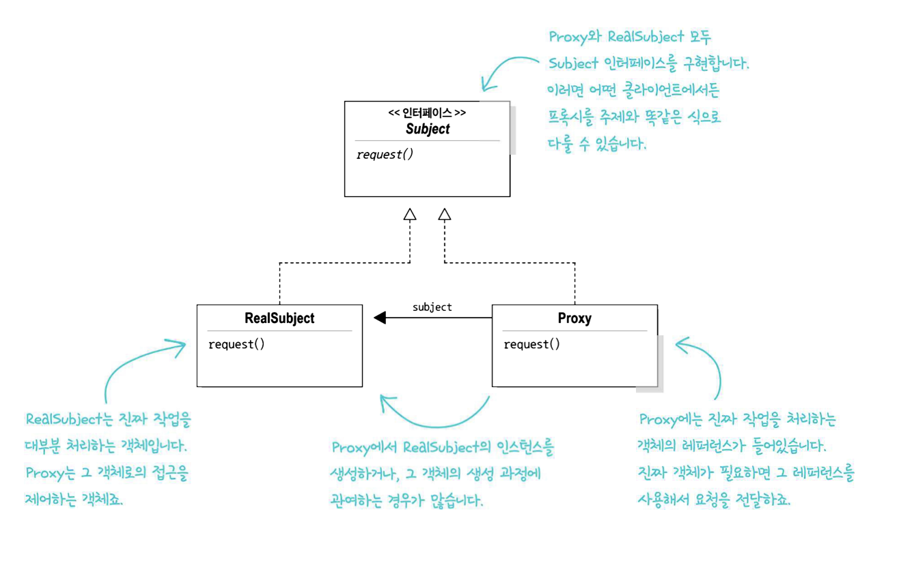
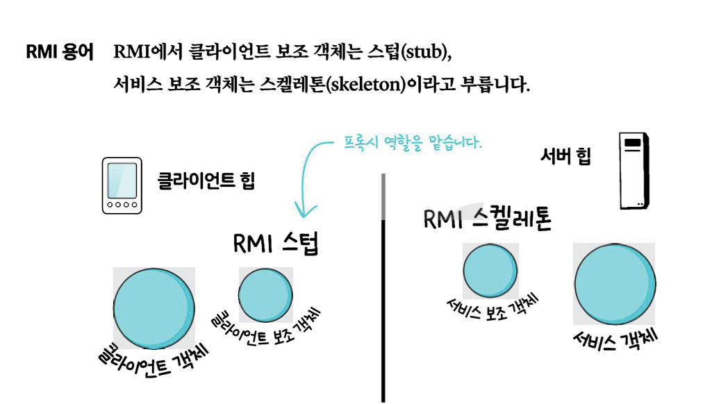
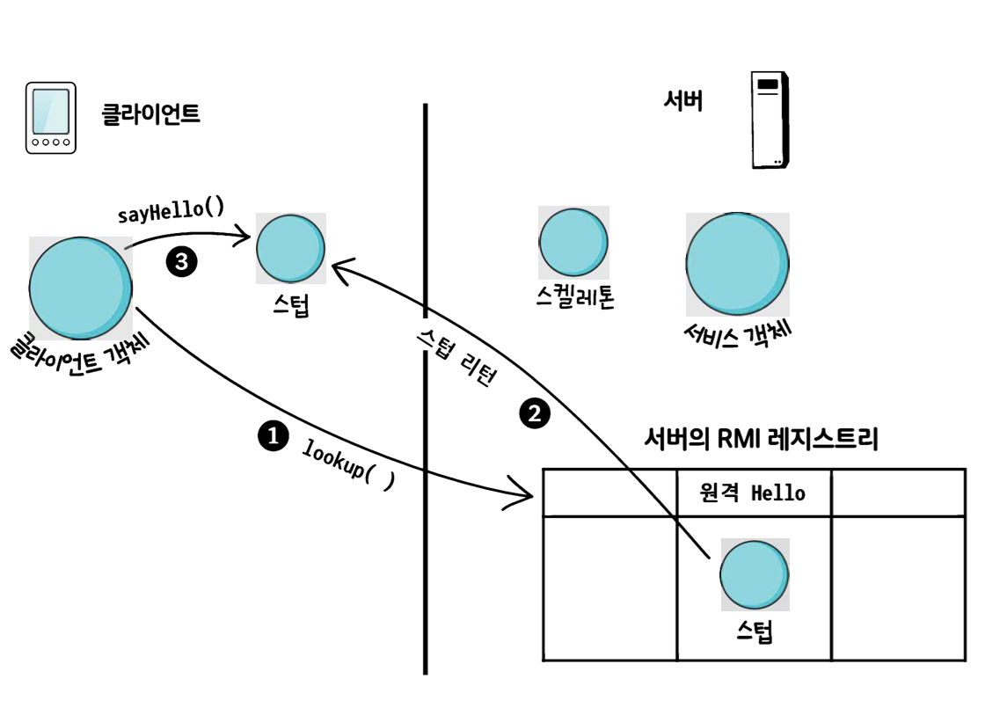
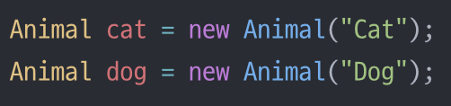

# 💈디자인 패턴 (#프록시 패턴) - 
- 클라이언트 객체는 원격 객체의 메서드 호출을 하는 것 처럼 행동
- 실제로는 로컬 힙에 들어있는 `Proxy`객체의 메서드를 호출하고 있다

### ☑️프록시 패턴에 대해 알아보자  
<br/>

## 📌 프록시 패턴을 사용하면 원격 객체라든가 생성하기 힘든 객체,<br>  보안이 중요한 객체와 같은 다른 객체로의 접근을 제어하는 대리인 객체를 만들 수 있다

  
<br/>

## <정의> 








- `RealSubject`는 진짜 작업을 대부분 처리하는 객체이다 <br> `Proxy`는 그 객체로의 접근을 제어하는 객체다
- 원격프록시 vs 가상프록시(`spring`)

--------------
## RMI
- `RMI`는 우리 대신 클라이언트와 서비스 보조 객체를 만들어 준다.
- 보조객체에는 원격 서비스와 똑같은 메서드가 들어있다
- `RMI`를 사용하면 네트워킹 및 입출력 관련 코드를 직접 작성하지 않아도 된다.






-------------------


## 직렬화
- 자바 시스템 내부에서 사용되는 `Object` 또는 `Data`를 외부의 자바 시스템에서도 사용할 수 있도록 `byte`형태로 데이터를 변환하는 기술

## 역직렬화
- `byte`로 변환된 `Data`를 원래대로 `Object`나 `Data`로 변환하는 기술을 역직렬화라고 한다
- 직렬화된 바이트 형태의 데이터를 객체로 변환해서 `JVM`으로 상주시키는 형태


## 프록시 종류
- 원격 프록시 : 클라이언트와 원격 객체 사이의 데이터 전달을 관리
- 가상 프록시 : 인스턴스를 만드는 데 많은 비용이 드는 객체로의 접근을 제어한다
- 보호 프록시 : 호출하는 쪽의 권한에 따라서 객체에 있는 메소드로의 접근을 제어한다


----------------

## 💥마치며..  

- **프록시 패턴** : 다른 객체를 감싸서 접근을 제어한다

- 데코레이터 : 다른 객체를 감싸서 새로운 행동을 추가해 준다.
- 퍼사드 : 여러 객체를 감싸서 인터페이스를 단순하게 만들어준다.
- 어댑터 : 다른 객체를 감싸서 다른 인터페이스를 제공한다.

<br/>

__⭕상황에 맞게 변경할 수 있는 **유연한** 디자인을 만드는게 중요!!!__

<br/>

### <📦객체지향의 기초>
- 추상화
- 캡슐화
- 다형성
- 상속

<br/>


### <📦객체지향의 원칙(🍀디자인원칙🍀)>
- 바뀌는 부분은 캡슐화한다. -> **관리의 용이성**
    - 달라지는 부분과 달라지지 않는 부분을 분리
- 상속보다는 구성을 활용한다 -> **재사용성**
    - ex)`Car car = new Car;` 변수사용 (상속을 사용하는 것이 아닌)
    - `is a`로 표현하는 것이아닌 `has a` 객체가 단순하게 참조하여 사용하는 것
    ``` java
    public class Print{
      private Car car = new Car();
    }
    ```
- 구현보다는 인터페이스에 맞춰서 프로그래밍 한다. -> **확장성**
    - GOF원칙, 인터페이스를 이용하자!
- 상호작용하는 객체 사이에서는 가능하면 느슨한 결합을 사용해야한다 -> **재사용성, 유연성**
    - 인터페이스를 구현하는 객체를 만들면 느슨한 결합을 만들기 수월<br>(확장성이 높고 의존성이 낮다)
- 클래스는 확장에는 열려 있어야 하지만 변경에는 닫혀 있어야 한다
  - OCP : 기존코드 수정없이 행동을 확장한다 (**행동을 상속받는 것이 아닌**) 
  - 잘못된 OCP

    

  - OCP
  
    
    
  - **구성** (**슈퍼클래스인 인스턴스변수로 연결**)과 위임으로 객체의 행동 확장으로 실행중에 동적으로 행동 설정 가능<br>ex)`this.Beverage = Beverage;`
- 추상화된 것에 의존하게 만들고 구상클래스에 의존하지 않게 만든다
  - 구상클래스가 아닌 추상클래스와 인터페이스에 맞춰서 코딩 -> 느슨한결합, 캡슐화
  - `Pizza인터페이스(or추상클래스)`라는 추상에 의존하게 만들자
- 여러클래스가 복잡하게 얽혀있어서 한부분의 수정으로 줄줄이 수정하게 되는 것을 막자
  - 최소지식 원칙(**객체사이의 상호작용은 될 수 있으면 아주 가까운경우에만 허용**) (**밑에는 원칙을 지키지 않은 경우**)
  - 객체가 대신 요청하도록 하자.(각각의 객체에 역할과 책임을 분배하자)
    ```java
    public float getTemp(){
      return station.getThermometer().getTemperature();
    }
    ```
- 저수준 구성요소가 시스템에 접속할 수는 있지만, 언제 어떻게 사용될지는 고수준 요소가 결정
  - **할리우드 원칙(고수준이 저수준에게 필요할 때 연락주겠다, 먼저 연락하지 마라)**
  - 고수준(`상위클래스`), 저수준(`하위클래스`)
- 어떤 클래스에서 맡고 있는 모든 역할은 나중에 코드 변화를 불러올 수 있다<br> 역할이 2개 이상 있으면 바뀔 수 있는 부분이 2개 이상이된다
  - 하나의 클래스는 하나의 역할만 맡아야 된다.
  - **단일 역할 원칙**
  - 응집도가 높아야 한다
    - 한 클래스 또는 모듈이 특정 목적이나 역할을<br> 얼마나 일관되게 지원하는지를 나타내는 척도
- +) 더 추가될 예정


<br/>


