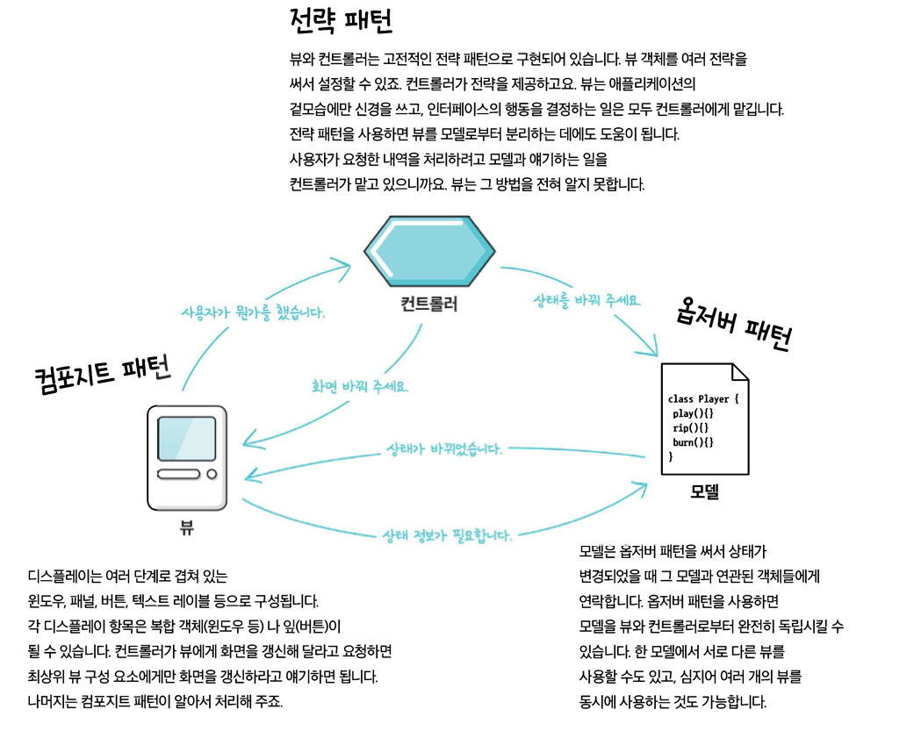
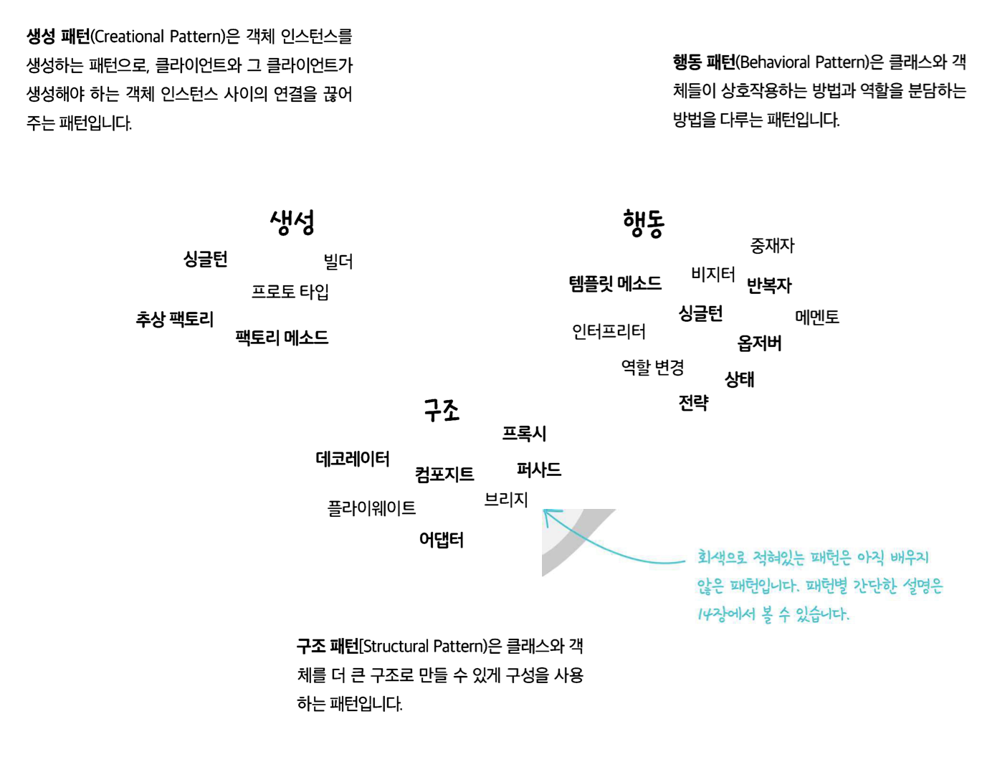
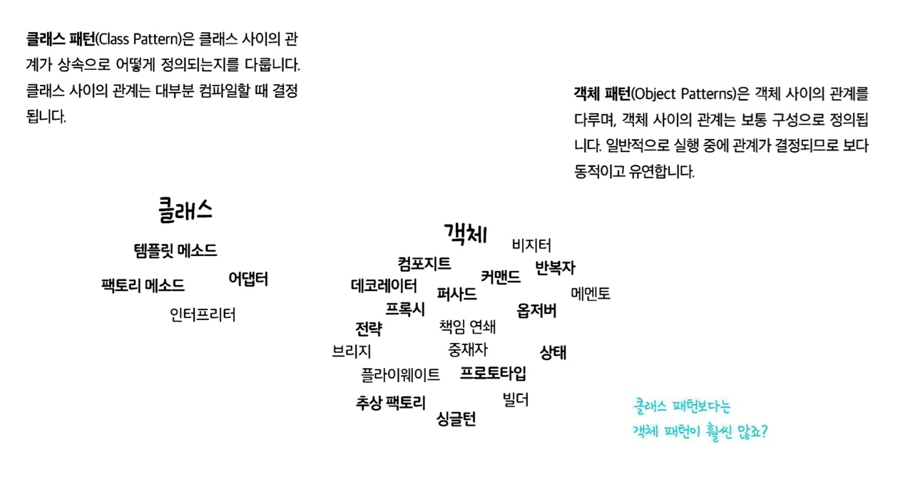
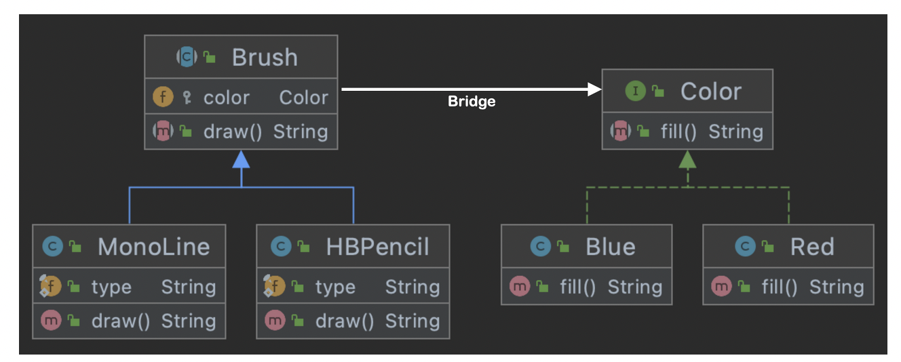
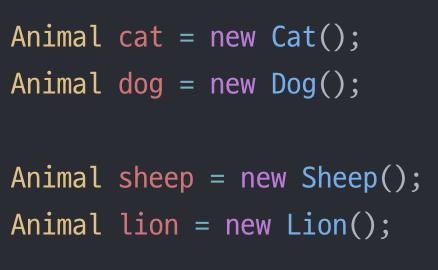

# 💈디자인 패턴 (#복합 패턴) - MVC
- 억지로 패턴을 적용할려고 하지 말자!

### ☑️복합 패턴에 대해 알아보자  
<br/>

## 📌 복합패턴이란 반복적으로 생길 수 있는 일반적인 문제를 해결하는 용도로 <br> 2개 이상의 패턴을 결합해서 사용하는 것을 뜻한다
## 📌 모델-뷰-컨트롤러(MVC)는 옵저버 패턴-컴포지트 패턴-전략 패턴으로 구성되어 있다<br> -> MVC 패턴(복합패턴)

  
<br/>

## <정의> 




- `Model`은 `Controller`와 `View`에 의존하지 않아야 한다.
  - `Controller`와 `View`를 `import`하면 안된다

- `View`는 `Model`에만 의존해야 하고, `Controller`에는 의존하면 안된다
  - `View`내부에 `Model`의 코드만 있을 수 있고, `Controller`의 코드가 있으면 안된다.

- `View`가 `Model`로부터 데이터를 받을 때는, <br> 사용자마다 다르게 보여주어야 하는 데이터에 대해서만 받아야 한다

- `Controller`는 `Model`과 `View`에 의존해도 된다.
  - `Controller`내부에는 `Model`과 `View`의 코드가 있을 수 있다.

- `View`가 `Model`로부터 데이터를 받을 때, 반드시 `Controller`에서 받아야 한다.
-------------

``` java
// BPM 제어 도구 Model Interface
public interface BeadModelInteface{
  void initialize();

  void on();

  void off();

  void setBPM(int bpm);

  int getBPM();

  void registerObserver(BeatObserver o);

  void removeObserver(BeatObserver o);

  void registerObserver(BPMObserver o);

  void removeObserver(BPMObserver o);
}

```
``` java
// Model


public class BeatModel implements BeatModelInterface, Runnable {
	List<BeatObserver> beatObservers = new ArrayList<BeatObserver>();
	List<BPMObserver> bpmObservers = new ArrayList<BPMObserver>();
	int bpm = 90;
	Thread thread;
	boolean stop = false;
	Clip clip;

	public void initialize() {
		try {
			File resource = new File("clap.wav");
			clip = (Clip) AudioSystem.getLine(new Line.Info(Clip.class));
			clip.open(AudioSystem.getAudioInputStream(resource));
		}
		catch(Exception ex) {
			System.out.println("Error: Can't load clip");
			System.out.println(ex);
		}
	}

	public void on() {
		bpm = 90;
		//notifyBPMObservers();
		thread = new Thread(this);
		stop = false;
		thread.start();
	}

	public void off() {
		stopBeat();
		stop = true;
	}

	public void run() {
		while (!stop) {
			playBeat();
			notifyBeatObservers();
			try {
				Thread.sleep(60000/getBPM());
			} catch (Exception e) {}
		}
	}

	public void setBPM(int bpm) {
		this.bpm = bpm;
		notifyBPMObservers();
	}

	public int getBPM() {
		return bpm;
	}

	public void registerObserver(BeatObserver o) {
		beatObservers.add(o);
	}

	public void notifyBeatObservers() {
		for(int i = 0; i < beatObservers.size(); i++) {
			BeatObserver observer = (BeatObserver)beatObservers.get(i);
			observer.updateBeat();
		}
	}

	public void registerObserver(BPMObserver o) {
		bpmObservers.add(o);
	}

	public void notifyBPMObservers() {
		for(int i = 0; i < bpmObservers.size(); i++) {
			BPMObserver observer = (BPMObserver)bpmObservers.get(i);
			observer.updateBPM();
		}
	}

	public void removeObserver(BeatObserver o) {
		int i = beatObservers.indexOf(o);
		if (i >= 0) {
			beatObservers.remove(i);
		}
	}

	public void removeObserver(BPMObserver o) {
		int i = bpmObservers.indexOf(o);
		if (i >= 0) {
			bpmObservers.remove(i);
		}
	}

	public void playBeat() {
		clip.setFramePosition(0);
		clip.start();
	}
	public void stopBeat() {
		clip.setFramePosition(0);
		clip.stop();
	}

}

...

```


--------------
## 디자인 패턴의 정의
- **패턴**은 특정 컨텍스트 내에서 주어진 문제의 해결책 이다.
- **컨텍스트** : 패턴이 적용되는 상황을 뜻한다(반복적으로 일어날 수 있는 상황)
  - 예) 객체들의 컬렉션이 주어져 있다
- **문제** : 컨텍스트 내에서 이뤄야 하는 목표를 뜻한다
  - 예) 컬렉션의 구현을 드러내지 않으면서 그 안에 있는 각 객체를 대상으로 순환 작업을 할 수 있어야 한다.
- **해결책** : 우리가 찾아내야 하는 것
  - 예) 반복 작업을 별도의 클래스로 **캡슐화**

- 패턴 카탈로그 여러개 중 (`GOF의 디자인 패턴`)은 23개의 기본 패턴이 수록되어 있다.
- 다양한 영역에 맞는 패턴 카탈로그들이 속속들이 출시되고 있다.







-------------------


## 안티 패턴
- 어떤 문제의 나쁜 해결책에 이르는 길을 알려준다


----------------

## 기타 패턴

-  ### 브리지 패턴
	- 구현과 더불어 **추상화** 부분까지 변경해야 한다면 브리지 패턴을 써야한다
	- 


- ### 빌더 패턴
	- 제품을 여러단계로 나눠서 만들도록 제품 생산단계를 캡슐화하고 싶다면 빌더 패턴을 사용
	- ``` java
		public class Computer {
    	//required parameters
    	private String HDD;
    	private String RAM;
    	//optional parameters
    	private boolean isGraphicsCardEnabled;
    	private boolean isBluetoothEnabled;
			public String getHDD() {
        return HDD;
  	  }
			public String getRAM() {
        return RAM;
    	}

    	public boolean isGraphicsCardEnabled() {
        return isGraphicsCardEnabled;
    	}

    	public boolean isBluetoothEnabled() {
        return isBluetoothEnabled;
    	}

	    private Computer(ComputerBuilder builder) {
        this.HDD=builder.HDD;
        this.RAM=builder.RAM;
        this.isGraphicsCardEnabled=builder.isGraphicsCardEnabled;
        this.isBluetoothEnabled=builder.isBluetoothEnabled;
  	  }

    	//Builder Class
	    public static class ComputerBuilder{

        // required parameters
  	      private String HDD;
    	    private String RAM;

  	      // optional parameters
	        private boolean isGraphicsCardEnabled;
    	    private boolean isBluetoothEnabled;
		
      	  public ComputerBuilder(String hdd, String ram){
        	    this.HDD=hdd;
          	  this.RAM=ram;
        	}

        	public ComputerBuilder setGraphicsCardEnabled(boolean isGraphicsCardEnabled) {
            this.isGraphicsCardEnabled = isGraphicsCardEnabled;
            return this;
	        }

	        public ComputerBuilder setBluetoothEnabled(boolean isBluetoothEnabled) {
  	          this.isBluetoothEnabled = isBluetoothEnabled;
    	        return this;
      	  }
		
        	public Computer build(){
          	  return new Computer(this);
        	}

    			}

				}
		```
		``` java
		public class TestBuilderPattern {
    	public static void main(String[] args) {
      	  Computer comp = new Computer.ComputerBuilder("500 GB", "2 GB")
                .setBluetoothEnabled(true)
                .setGraphicsCardEnabled(true)
                .build();
    		}
		}
		```


- ### 책임연쇄 패턴
	- 주어진 요청을 검토하는 객체 사슬을 생성
	- 그 사슬에 속해있는 각 객체는 자기가 받은 요청을 검사해서 직접 처리하거나<br> 사슬에 들어있는 다른 객체에게 넘긴다


- ### 플라이웨이트 패턴
	- 어떤 클래스의 인스턴스 하나로 여러개의 **가상인스턴스**를 제공하고 싶다면 플라이웨이트 파턴을 사용
	- 인스턴스를 가능한 대로 공유시켜 쓸데없이 `new`연산자를 통한 메모리 낭비를 줄이는 방식
	- 예시 : **로직에 의해 같은 색상의 원은 1개만 생성되어 공유된다**


- ### 인터프리터 패턴
	- 문법과 구문을 번겨하는 인터프리터 클래스를 기반으로 간단한 언어를 정의


- ### 중재자 패턴
	- 중재자를 추가하기 전에는 모든 객체가 다른 객체와 서로 알고 있어야 했다
	- 모든시스템을 제어하는 로직이 들어있다


- ### 메멘토 패턴
	- 시스템에서 핵심적인 기능을 담당하는 객체의 상태 저장
	- 핵심적인 객체의 캡슐화 유지
	- 


- ### 프로토타입 패턴
	- 어떤 클래스의 인스턴스를 만들 때 자원과 시간이 많이 들거나 복잡하다면 **프로토타입** 패턴을 써야 한다
	- `clone()`메서드를 사용하여 1회의 DB접근을 통해 가져온 데이터를 다른 객체에 <br> 복사하여(`new`) 사용하면 비용적인 부분에서 절감할 수 있을 것이다.


- ### 비지터 패턴
	- 다양한 객체에 새로운 기능을 추가해야 하는데 캡슐화가 별로 중요하지 않다면 비지터 패턴을 사용
	- ``` java
		public interface Element {
    	int accept(Visitor visitor);
		}
		public class BagElement implements Element {
    	private final int price;
    	private final String name;

    	public BagElement(int price, String name) {
        this.name = name;
        this.price = price;
    	}

    	public int getPrice() {
      	  return this.price;
    	}

    	public String getName() {
        	return this.name;
    	}

    	@Override
    	public int accept(Visitor visitor) {
      	  return visitor.visit(this);
    	}
		}

		public class ShoesElement implements Element {
    	private final int price;
    	private final String name;
    	private final int size;

    	public ShoesElement(int price, String name, int size) {
      	  this.price = price;
	        this.name = name;
  	      this.size = size;
    	}

    	public int getPrice() {
      	  return this.price;
    	}

    	public String getName() {
      	  return this.name;
    	}

    	public int getSize() {
      	  return this.size;
    	}

    	@Override
    	public int accept(Visitor visitor) {
      	  return visitor.visit(this);
    	}
		}

		public interface Visitor {
    	int visit(BagElement bagElement);
    	int visit(ShoesElement shoesElement);
		}

		public class CartVisitor implements Visitor {
    	@Override
    	public int visit(BagElement bagElement) {
      	  System.out.println("가방 이름: "+ bagElement.getName() + "가격: "+ bagElement.getPrice());
	        return bagElement.getPrice();
  	  }

    	@Override
    	public int visit(ShoesElement shoesElement) {
      	  int price = shoesElement.getPrice();

        	if (shoesElement.getSize() > 270) {
          	  price += 2000;
        	} else if (shoesElement.getSize() < 230) {
          	  price -= 5000;
        	}

        	System.out.println("신발 이름: "+ shoesElement.getName() + "사이즈: "+ shoesElement.getSize() + "가격: "+ price);
        	return price;
    	}
		}

		Element[] elements = new Element[]{
    	    new BagElement(40000, "토트백"),
        	new BagElement(10000, "백팩"),
        	new ShoesElement(50000, "나이키", 210),
        	new ShoesElement(100000, "아디다스", 290),
        	new ShoesElement(156000, "리복", 255)
		};

		Visitor visitor = new CartVisitor();
		int totalPrice = 0;
		for (Element element: elements) {
    	totalPrice += element.accept(visitor);
		}
		// 가방 이름: 토트백가격: 40000
		// 가방 이름: 백팩가격: 10000
		// 신발 이름: 나이키사이즈: 210가격: 45000
		// 신발 이름: 아디다스사이즈: 290가격: 102000
		// 신발 이름: 리복사이즈: 255가격: 156000

		System.out.println("총 금액: "+ totalPrice);
		// 총 금액: 353000
		```


-----------------

<br/>

__⭕상황에 맞게 변경할 수 있는 **유연한** 디자인을 만드는게 중요!!!__

<br/>

### <📦객체지향의 기초>
- 추상화
- 캡슐화
- 다형성
- 상속

<br/>


### <📦객체지향의 원칙(🍀디자인원칙🍀)>
- 바뀌는 부분은 캡슐화한다. -> **관리의 용이성**
    - 달라지는 부분과 달라지지 않는 부분을 분리
- 상속보다는 구성을 활용한다 -> **재사용성**
    - ex)`Car car = new Car;` 변수사용 (상속을 사용하는 것이 아닌)
    - `is a`로 표현하는 것이아닌 `has a` 객체가 단순하게 참조하여 사용하는 것
    ``` java
    public class Print{
      private Car car = new Car();
    }
    ```
- 구현보다는 인터페이스에 맞춰서 프로그래밍 한다. -> **확장성**
    - GOF원칙, 인터페이스를 이용하자!
- 상호작용하는 객체 사이에서는 가능하면 느슨한 결합을 사용해야한다 -> **재사용성, 유연성**
    - 인터페이스를 구현하는 객체를 만들면 느슨한 결합을 만들기 수월<br>(확장성이 높고 의존성이 낮다)
- 클래스는 확장에는 열려 있어야 하지만 변경에는 닫혀 있어야 한다
  - OCP : 기존코드 수정없이 행동을 확장한다 (**행동을 상속받는 것이 아닌**) 
  - 잘못된 OCP

    

  - OCP
  
    
    
  - **구성** (**슈퍼클래스인 인스턴스변수로 연결**)과 위임으로 객체의 행동 확장으로 실행중에 동적으로 행동 설정 가능<br>ex)`this.Beverage = Beverage;`
- 추상화된 것에 의존하게 만들고 구상클래스에 의존하지 않게 만든다
  - 구상클래스가 아닌 추상클래스와 인터페이스에 맞춰서 코딩 -> 느슨한결합, 캡슐화
  - `Pizza인터페이스(or추상클래스)`라는 추상에 의존하게 만들자
- 여러클래스가 복잡하게 얽혀있어서 한부분의 수정으로 줄줄이 수정하게 되는 것을 막자
  - 최소지식 원칙(**객체사이의 상호작용은 될 수 있으면 아주 가까운경우에만 허용**) (**밑에는 원칙을 지키지 않은 경우**)
  - 객체가 대신 요청하도록 하자.(각각의 객체에 역할과 책임을 분배하자)
    ```java
    public float getTemp(){
      return station.getThermometer().getTemperature();
    }
    ```
- 저수준 구성요소가 시스템에 접속할 수는 있지만, 언제 어떻게 사용될지는 고수준 요소가 결정
  - **할리우드 원칙(고수준이 저수준에게 필요할 때 연락주겠다, 먼저 연락하지 마라)**
  - 고수준(`상위클래스`), 저수준(`하위클래스`)
- 어떤 클래스에서 맡고 있는 모든 역할은 나중에 코드 변화를 불러올 수 있다<br> 역할이 2개 이상 있으면 바뀔 수 있는 부분이 2개 이상이된다
  - 하나의 클래스는 하나의 역할만 맡아야 된다.
  - **단일 역할 원칙**
  - 응집도가 높아야 한다
    - 한 클래스 또는 모듈이 특정 목적이나 역할을<br> 얼마나 일관되게 지원하는지를 나타내는 척도


<br/>


